# 보담(BoDam) 시스템 아키텍처 문서

> **프로젝트**: 소방관 커피 기부 플랫폼
> **작성일**: 2025-10-01
> **기술 스택**: FastAPI + Next.js + PostgreSQL + Celery + Redis

---

## 📋 목차

1. [전체 시스템 아키텍처](#전체-시스템-아키텍처)
2. [파이프라인별 상세 설계](#파이프라인별-상세-설계)
   - [1. 사용자 인증 파이프라인](#1-사용자-인증-파이프라인)
   - [2. 기부 처리 파이프라인](#2-기부-처리-파이프라인)
   - [3. 결제/환불 파이프라인](#3-결제환불-파이프라인)
   - [4. 소방서 데이터 수집 파이프라인](#4-소방서-데이터-수집-파이프라인)
   - [5. 실시간 알림 파이프라인](#5-실시간-알림-파이프라인)
   - [6. AI/뉴스 분석 파이프라인](#6-ai뉴스-분석-파이프라인)
   - [7. 관리자 파이프라인](#7-관리자-파이프라인)
3. [데이터 플로우](#데이터-플로우)
4. [기술 스택 상세](#기술-스택-상세)
5. [프런트엔드-백엔드 정합성 로드맵](#프런트엔드-백엔드-정합성-로드맵)

---

## 전체 시스템 아키텍처

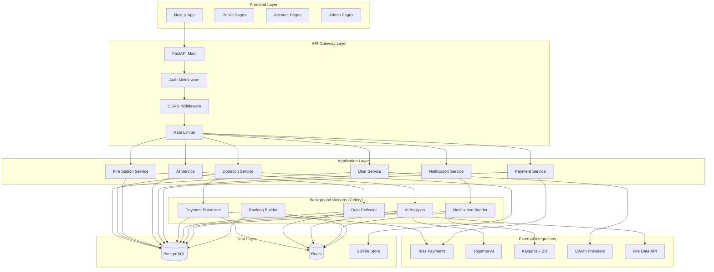

---

## 파이프라인별 상세 설계

### 1. 사용자 인증 파이프라인

**목적**: 사용자 회원가입, 로그인, 소셜 인증, 비밀번호 재설정 처리

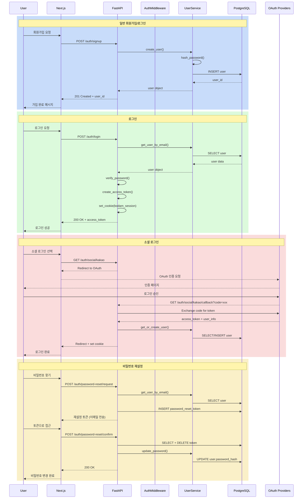

**주요 컴포넌트**:
- **API**: [src/api/auth.py](../backend/src/api/auth.py)
- **Service**: [src/services/user_service.py](../backend/src/services/user_service.py)
- **Middleware**: [src/middleware/auth.py](../backend/src/middleware/auth.py)
- **Security**: [src/security/tokens.py](../backend/src/security/tokens.py), [src/security/passwords.py](../backend/src/security/passwords.py)
- **Models**: [src/models/user.py](../backend/src/models/user.py), [src/models/password_reset.py](../backend/src/models/password_reset.py)

**데이터 흐름**:
1. 사용자 입력 → Frontend 유효성 검사
2. API 엔드포인트 → AuthMiddleware 검증 (로그인 필요 시)
3. UserService → 비즈니스 로직 처리
4. PostgreSQL → 사용자 데이터 저장/조회
5. JWT 토큰 생성 → HttpOnly Cookie 설정

**보안 요소**:
- bcrypt 비밀번호 해싱
- JWT 토큰 기반 인증
- HttpOnly, Secure Cookie
- Rate Limiting (로그인 시도 제한)
- CSRF 보호 (SameSite Cookie)

---

### 2. 기부 처리 파이프라인

**목적**: 일회성/정기 기부 생성, 조회, 영수증 발급

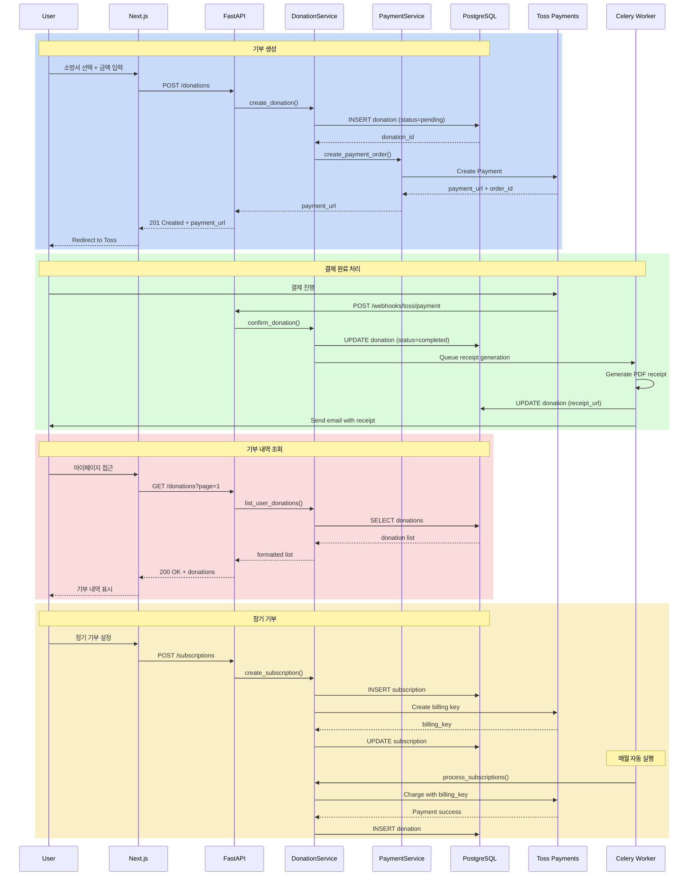

**주요 컴포넌트**:
- **API**: [src/api/donations.py](../backend/src/api/donations.py)
- **Service**: [src/services/donation_service.py](../backend/src/services/donation_service.py)
- **Worker**: [src/workers/payment_processor.py](../backend/src/workers/payment_processor.py)
- **Integration**: [src/integrations/toss_payments.py](../backend/src/integrations/toss_payments.py)
- **Models**: [src/models/donation.py](../backend/src/models/donation.py)

**상태 전이**:
```
pending → processing → completed
         ↓
       failed → refunded
```

---

### 3. 결제/환불 파이프라인

**목적**: Toss Payments 연동, 결제 확인, 환불 처리

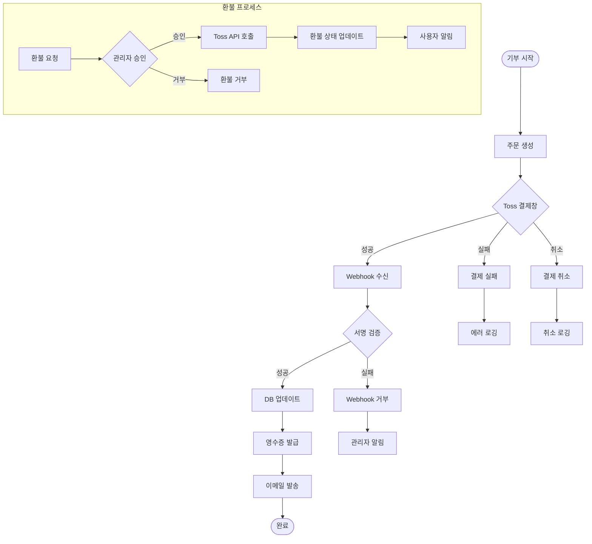

**주요 컴포넌트**:
- **Webhook**: [src/api/webhooks/toss.py](../backend/src/api/webhooks/toss.py)
- **Service**: [src/services/refund_service.py](../backend/src/services/refund_service.py)
- **API**: [src/api/refunds.py](../backend/src/api/refunds.py)
- **Models**: [src/models/refund.py](../backend/src/models/refund.py)

**Webhook 처리**:
1. Toss → `/webhooks/toss/payment` POST
2. `X-Toss-Signature` 검증
3. 결제 상태 업데이트 (pending → completed)
4. 영수증 생성 작업 큐잉
5. 200 OK 응답

---

### 4. 소방서 데이터 수집 파이프라인

**목적**: 외부 API에서 소방서 정보, 화재 사건 데이터 수집 및 동기화

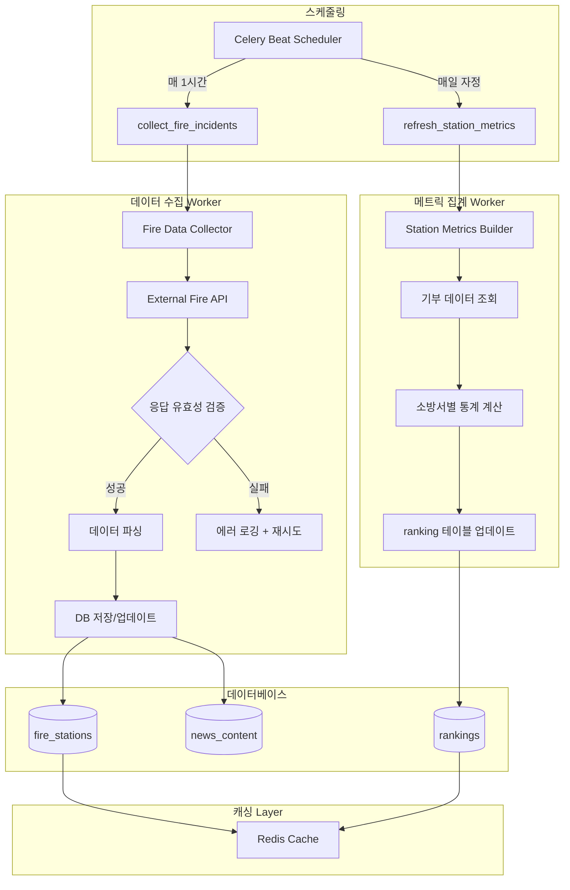

**주요 컴포넌트**:
- **Worker**: [src/workers/data_collector.py](../backend/src/workers/data_collector.py)
- **Collector**: [src/collectors/fire_data_collector.py](../backend/src/collectors/fire_data_collector.py)
- **Service**: [src/services/fire_station_service.py](../backend/src/services/fire_station_service.py)
- **Models**: [src/models/fire_station.py](../backend/src/models/fire_station.py)

**수집 주기**:
- 화재 사건: 1시간마다
- 소방서 메트릭: 매일 자정
- 뉴스 수집: 6시간마다

---

### 5. 실시간 알림 파이프라인

**목적**: WebSocket, KakaoTalk, 이메일을 통한 실시간 알림 전송

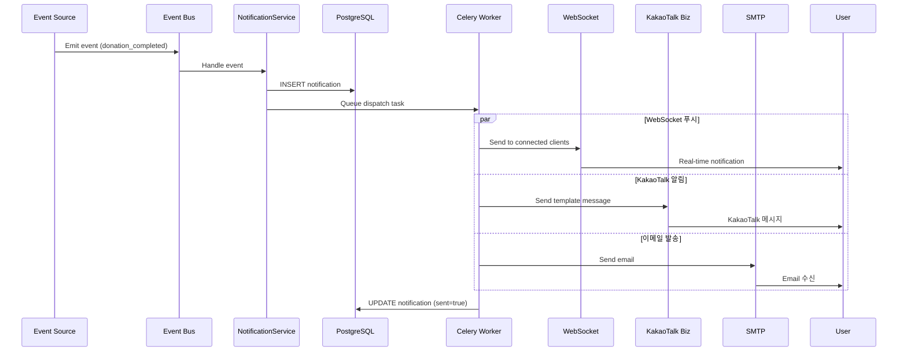

**주요 컴포넌트**:
- **API**: [src/api/webpush.py](../backend/src/api/webpush.py), [src/api/kakao.py](../backend/src/api/kakao.py)
- **Service**: [src/services/notification_service.py](../backend/src/services/notification_service.py)
- **Worker**: [src/workers/notification_sender.py](../backend/src/workers/notification_sender.py)
- **Integration**: [src/integrations/kakao_biz.py](../backend/src/integrations/kakao_biz.py)
- **Models**: [src/models/notification.py](../backend/src/models/notification.py)
- **Event Bus**: [src/events/event_bus.py](../backend/src/events/event_bus.py)

**WebSocket 연결**:
```
ws://localhost:8000/ws/notifications
```

**알림 타입**:
- `donation_completed`: 기부 완료
- `refund_approved`: 환불 승인
- `fire_incident_nearby`: 인근 화재 발생
- `ranking_updated`: 랭킹 변동

---

### 6. AI/뉴스 분석 파이프라인

**목적**: Together AI를 활용한 뉴스 수집 및 자연어 분석

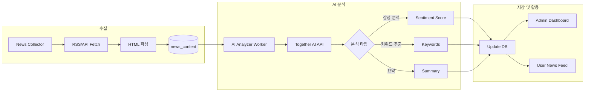

**주요 컴포넌트**:
- **Worker**: [src/workers/ai_analyzer.py](../backend/src/workers/ai_analyzer.py)
- **Service**: [src/services/ai_service.py](../backend/src/services/ai_service.py)
- **Collector**: [src/collectors/news_collector.py](../backend/src/collectors/news_collector.py)
- **Integration**: [src/integrations/together_ai.py](../backend/src/integrations/together_ai.py)
- **Models**: [src/models/news_content.py](../backend/src/models/news_content.py)

**AI 처리 플로우**:
1. 뉴스 수집 (6시간 주기)
2. 텍스트 전처리
3. Together AI API 호출 (LLM 분석)
4. 결과 파싱 및 저장
5. 관리자 대시보드 업데이트

---

### 7. 관리자 파이프라인

**목적**: 관리자 전용 기능 (환불 승인, 리소스 관리, LLM 검색)

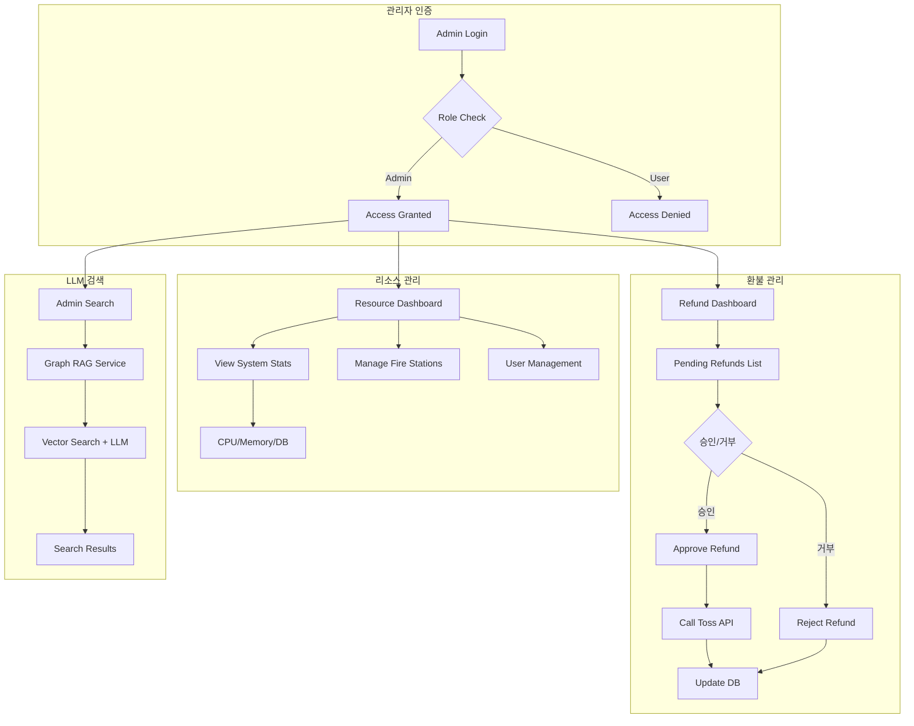

**주요 컴포넌트**:
- **API**: [src/api/admin/refunds.py](../backend/src/api/admin/refunds.py), [src/api/admin/resources.py](../backend/src/api/admin/resources.py), [src/api/admin/search.py](../backend/src/api/admin/search.py)
- **Service**: [src/services/admin/llm_search_service.py](../backend/src/services/admin/llm_search_service.py)
- **Integration**: [src/integrations/graph.py](../backend/src/integrations/graph.py)

**관리자 권한 체크**:
```python
# src/middleware/auth.py
if user.role != "admin":
    raise HTTPException(403, "Admin required")
```

---

## 데이터 플로우

### 전체 데이터 흐름도

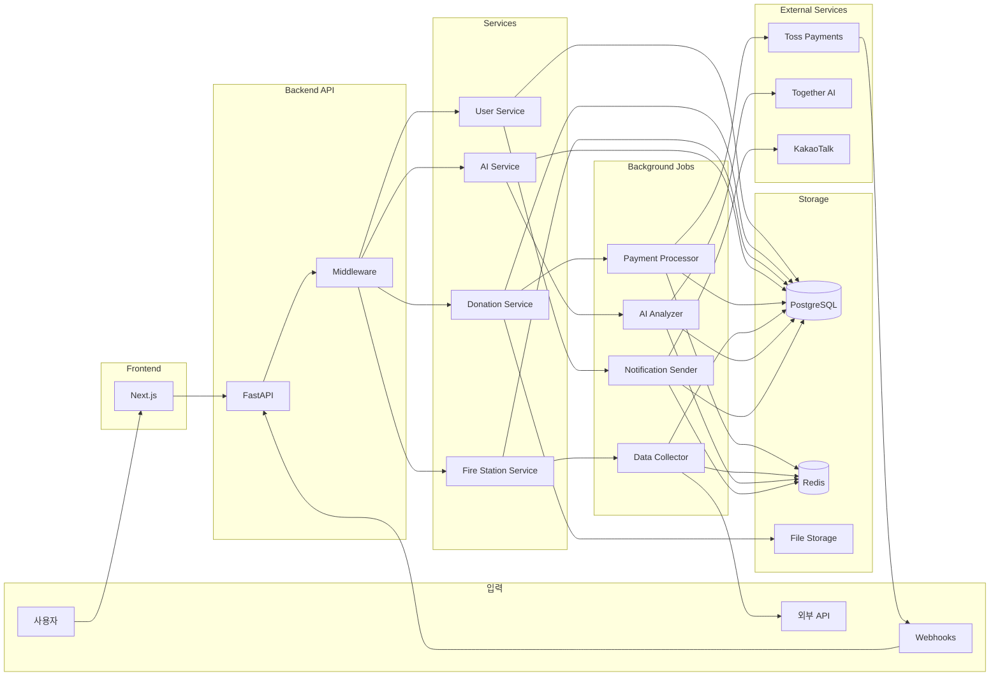

### 데이터베이스 주요 테이블

| 테이블 | 목적 | 주요 컬럼 |
|--------|------|-----------|
| `users` | 사용자 정보 | id, email, password_hash, role |
| `donations` | 기부 내역 | id, user_id, fire_station_id, amount, status |
| `fire_stations` | 소방서 정보 | id, name, region, location (PostGIS) |
| `refunds` | 환불 요청 | id, donation_id, status, admin_note |
| `notifications` | 알림 | id, user_id, type, content, sent |
| `news_content` | 뉴스 기사 | id, title, content, ai_summary |
| `rankings` | 랭킹 | id, fire_station_id, rank, total_donations |
| `password_reset` | 비밀번호 재설정 토큰 | id, user_id, token, expires_at |

---

## 기술 스택 상세

### Backend (FastAPI)

```
backend/
├── src/
│   ├── api/              # REST API endpoints
│   │   ├── auth.py       # 인증
│   │   ├── donations.py  # 기부
│   │   ├── stations.py   # 소방서
│   │   ├── webhooks/     # Webhook 수신
│   │   └── admin/        # 관리자 API
│   ├── services/         # 비즈니스 로직
│   ├── models/           # SQLAlchemy Models
│   ├── workers/          # Celery Tasks
│   ├── middleware/       # 미들웨어 (Auth, CORS, Rate Limit)
│   ├── integrations/     # 외부 API 연동
│   ├── security/         # 보안 (JWT, Password Hash)
│   └── database/         # DB 연결
└── tests/
```

**핵심 라이브러리**:
- `FastAPI`: 고성능 비동기 웹 프레임워크
- `SQLAlchemy 2.0`: ORM (async 지원)
- `Celery`: 백그라운드 작업 큐
- `Redis`: 캐싱 + Celery 브로커
- `pgvector`: 벡터 검색 (AI 임베딩)
- `PostGIS`: 지리 데이터 처리

### Frontend (Next.js)

```
frontend/
├── src/
│   ├── app/
│   │   ├── (public)/     # 공개 페이지
│   │   ├── (account)/    # 로그인 필요 페이지
│   │   └── layout.tsx    # 공통 레이아웃
│   ├── components/
│   │   ├── base/         # 기본 컴포넌트 (Button, Card)
│   │   ├── feature/      # 기능 컴포넌트 (Header, Footer)
│   │   └── home/         # 홈 섹션
│   └── lib/
│       ├── api.ts        # API 클라이언트
│       └── data/         # Static 데이터
└── public/
```

**핵심 라이브러리**:
- `Next.js 13`: React 프레임워크 (Pages Router)
- `TailwindCSS`: 유틸리티 CSS 프레임워크
- `@tosspayments/payment-sdk`: Toss 결제 SDK

### Infrastructure

```
infra/
├── docker/
│   ├── Dockerfile.backend
│   └── Dockerfile.frontend
├── k8s/
│   ├── deployment.yaml
│   ├── service.yaml
│   └── ingress.yaml
└── ci-cd/
    └── github-actions.yaml
```

**배포 환경**:
- **컨테이너**: Docker
- **오케스트레이션**: Kubernetes
- **모니터링**: Prometheus + Grafana
- **로깅**: Structured logging (structlog)

---

## 파이프라인 통합 시나리오

### 시나리오 1: 사용자가 소방서에 기부하는 전체 플로우

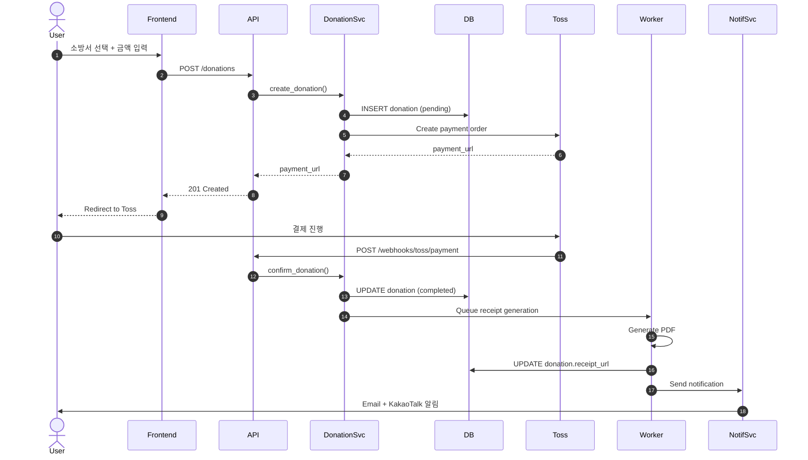

### 시나리오 2: 관리자가 환불 요청 처리

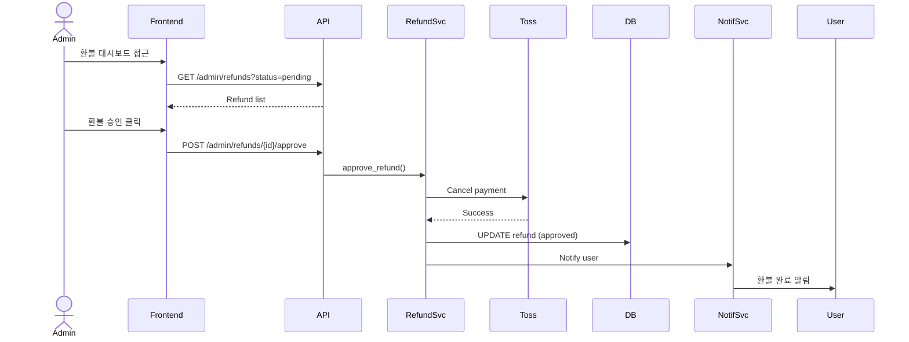

---

## 성능 최적화 전략

### 1. 캐싱 전략
- **Redis**: 소방서 목록, 랭킹 데이터 (TTL 1시간)
- **CDN**: 정적 파일 (이미지, CSS, JS)
- **DB 쿼리 캐싱**: SQLAlchemy 쿼리 결과 메모이제이션

### 2. 비동기 처리
- **Celery**: 무거운 작업 (PDF 생성, AI 분석, 이메일 발송)
- **FastAPI Async**: I/O 바운드 작업 (DB 쿼리, HTTP 요청)

### 3. 데이터베이스 최적화
- **인덱싱**: user.email, donation.user_id, fire_station.region
- **파티셔닝**: donations 테이블 (created_at 기준 월별)
- **Connection Pooling**: AsyncEngine (max 20 connections)

### 4. 모니터링
- **Slow Query Logging**: [src/database/slow_query.py](../backend/src/database/slow_query.py)
- **Prometheus Metrics**: [src/monitoring/metrics.py](../backend/src/monitoring/metrics.py)
- **Structured Logging**: [src/monitoring/logging.py](../backend/src/monitoring/logging.py)

---

## 프런트엔드-백엔드 정합성 로드맵

### 프런트엔드 기대 데이터 & 플로우
- `frontend/src/lib/data/emergency.ts:7` `EmergencyStation` 타입과 `/emergency-stations` 엔드포인트를 가정해 실시간 출동 현황을 표시
- `frontend/src/app/(public)/donations/page.tsx:600` 부근에서 단일/복수/정기 기부, Toss 결제, 그룹 기부 메타데이터를 모두 한 번에 처리하도록 UI 구성
- `frontend/src/app/(account)/mypage/page.tsx:100` 이후 마이페이지가 개인/단체 기부 내역, 정기 결제, 환불 사유, 영수증 여부 등을 관리하도록 더미 데이터를 사용
- `frontend/src/app/(public)/donation-ranking/page.tsx:9` 및 `frontend/src/components/home/DonationRanking.tsx:8` 에서 개인/단체/기업 랭킹 데이터를 100위 규모로 표시
- `frontend/src/components/feature/Header.tsx:40` 인앱 알림, 단체 로그인, 빠른 기부 조회 등 다양한 상태를 로컬 스토리지/가상 데이터에 의존

### 현재 Spec/Backend 상태
- 스펙 킷(`specs/001-bashclaudecli-specify-bodam/contracts`)에는 `/emergency-stations`, 알림, 랭킹, Toss 빌링 등 프런트가 기대하는 일부 엔티티가 정의되어 있지 않음
- FastAPI 라우트(`backend/src/api/stations.py`, `backend/src/api/donations.py`, `backend/src/api/groups.py` 등)는 목업 응답 또는 미구현 상태로 남아 있어 실제 데이터 제공 불가
- 도메인 모델(`backend/src/models`)은 기본 엔티티만 정의되어 있으며, 정기 결제 주기, 그룹 메타데이터, 알림 채널, 랭킹 지표 등 프런트 필드가 누락
- 결제 처리(Toss)와 관련된 백엔드 서비스/웹훅은 스켈레톤 수준이거나 미정리 상태로, 프런트 결제 흐름과 동기화가 불가

### 격차 요약

| 영역 | 프런트 요구 | 스펙/백엔드 현황 |
| --- | --- | --- |
| 실시간 출동 현황 | `/emergency-stations` API, 우선순위/시간 필드 | 관련 API/모델 부재 |
| 기부/결제 | 단일·복수·정기 기부, Toss 결제, 그룹 메타데이터 | `Donation` 기본 필드만 존재, 정기결제/그룹 확장 미정 |
| 마이페이지 | 정기 기부 관리, 환불 사유, 영수증 발급, 다운로드 | 환불/영수증 모델은 일부 있으나 API 미정, UX는 더미 데이터 |
| 랭킹 | 개인/단체/기업 랭킹 뷰, 100위 데이터 | `Ranking` 모델만 존재, 계산/조회 API 미구현 |
| 알림/실시간 | 알림 센터, 소셜/단체 로그인 상태, 로그인 모달 이벤트 | `Notification` 모델만 정의, 발송/조회 API 미구현 |

### 우선 작업 순서
- **Step 1 — 정합성 명세화**: 프런트 요구 필드·플로우를 스펙 문서와 공유 타입 정의로 추가해 단일 진실 공급원(Single Source of Truth) 확보
- **Step 2 — 핵심 API 구현**: `/emergency-stations`, 기부 생성/조회, 그룹 검색, 랭킹 조회 등 주요 엔드포인트부터 실제 비즈니스 로직과 DB 연동으로 구현
-   - 기부/정기 결제 확장 세부 계획은 `docs/roadmap/step-02-donations.md` 참고
- **Step 3 — 모델/서비스 확장**: `Donation`, `Group`, `Ranking`, `Notification` 등에 정기 결제, 단체 메타, 통계 필드를 추가하고 마이그레이션 설계
- **Step 4 — 결제/정기 과금 설계**: Toss 빌링 키 저장, 구독 스케줄링, 웹훅 처리 등 프런트 결제 흐름과 맞는 백엔드 파이프라인 추가
- **Step 5 — 프런트 리팩터링**: API 제공 순서에 맞춰 더미 데이터 → 실데이터 전환, 상태 관리 단순화, 인증 연동을 단계적으로 적용

### 더미 데이터 정리 전략
- API가 준비된 화면부터 `apiRequest` 또는 서버 액션으로 실제 데이터를 주입하고, 성공적으로 연동된 후 더미 배열/로컬 상태를 제거
- 아직 API가 없는 컴포넌트는 스펙 반영과 백엔드 구현이 완료될 때까지 더미 유지, 단 문서화로 “의존 API”를 명시해 추후 제거 시점을 관리
- 공통 DTO/타입을 `frontend/src/lib/types`(신규) 등에 배치해 프런트·백엔드 간 스키마 드리프트를 최소화하고, 필요 시 자동 생성(OpenAPI → TS) 파이프라인 도입 검토

### 백엔드 확장 제안 (재사용 우선)

#### 1) 실시간 출동 현황 (`/emergency-stations`)
- **재사용 대상**: `FireStation` 모델·`FireStationService`(기본 메타), `NewsContent`(연관 사건)
- **신규 제안**:
  - `FireStationStatus` 테이블: `fire_station_statuses(id, station_id FK, status, priority, summary, updated_at)`
    - 이력 보존이 필요하면 `version`/`expires_at` 추가, 단순 스냅샷이면 1:1 unique 인덱스 유지
  - `FireStationActiveIncident` 조인 테이블로 다중 사건 연결 (`incident_id`는 기존 `NewsContent.id` 재사용)
  - `FireStationService`에 `get_emergency_statuses(region?, priority?, limit)` 메서드 추가 → 기존 세션/쿼리 패턴 재사용
  - FastAPI 라우트(`backend/src/api/stations.py`)에서 서비스 호출 후 Pydantic 응답 스키마 매핑

  **모델 세부안**
  - Enum 재활용: `StationStatus` 확장 혹은 신규 `LiveStatus(str, Enum)` 정의 (`dispatching`, `suppressing`, `standby`, `maintenance`)
  - `fire_station_statuses`
    | 컬럼 | 타입 | 비고 |
    | --- | --- | --- |
    | `id` | UUID (PK) | 기본값 `uuid_generate_v4()` |
    | `station_id` | UUID (FK → `fire_stations.id`, unique) | 실시간 상태 1:1 매핑 |
    | `status` | Enum(LiveStatus) | NOT NULL |
    | `priority` | Enum(`high`, `medium`, `low`) | NOT NULL, 기본값 `medium` |
    | `status_label` | String(50) | 다국어/가독성용 |
    | `summary` | Text | 선택 |
    | `updated_at` | TIMESTAMPTZ | NOT NULL, `server_default=now()` |
  - `fire_station_active_incidents`
    | 컬럼 | 타입 | 비고 |
    | --- | --- | --- |
    | `status_id` | UUID (FK → `fire_station_statuses.id`, PK 구성) |
    | `incident_id` | UUID (FK → `news_content.id`, PK 구성) |
    | `started_at` | TIMESTAMPTZ | 선택, 기본값 없음 |
    | 복합 PK(`status_id`, `incident_id`), FK ON DELETE CASCADE

  **마이그레이션 플랜**
  1. Alembic revision 생성 → 두 테이블/Enum 추가
  2. 기존 데이터 없음: 초기 상태는 빈 테이블, 운영 스크립트/ETL이 주입
  3. `station_id`에 unique 인덱스 부여하여 최신 상태 1개 유지, 필요 시 ETL에서 UPSERT
  4. `news_content`와 FK 연동을 위해 관련 테이블이 비어 있어도 FK 생성 가능 (ON DELETE SET NULL 옵션 고려)

  **서비스/엔드포인트 구현 순서**
  1. `FireStationService` + 리포지토리에 상태/사건 조인 쿼리 추가 (`select(FireStation, FireStationStatus, NewsContent)`)
  2. `EmergencyStationStatusDTO` Pydantic 모델 정의 (spec과 동기화)
  3. `/emergency-stations` 라우트 신설 → 서비스 호출 후 DTO 리스트 반환
  4. 캐싱 전략: 단기적으로 30초 TTL Redis 캐시(선택), 추후 스트리밍 데이터 접속 고려

#### 2) 기부/정기 결제/그룹 연계
- **재사용 대상**: `Donation` 모델·`DonationService`, `Group`/`GroupMembership`, `ReceiptService`, `RefundService`
- **신규 제안**:
  - `Donation`에 정기 결제 속성 확장: `subscription_id`, `billing_customer_key`, `next_billing_at`, `frequency`, `is_primary` 등 (필요 시 `Subscription` 별도 테이블)
  - 다중 소방서 기부 지원을 위해 `DonationAllocation` 테이블 도입 (`donation_id`, `fire_station_id`, `amount`, `allocation_type`) → 기존 단일 FK는 대표 소방서로 유지
  - `GroupDonation` 뷰/테이블로 단체 기부 메타(`group_id`, `initiator_user_id`, `message`)를 추적하며 기존 `GroupService` 로직을 재사용
  - Toss 연동은 `donation_service.py`에 결제 준비/확정 함수를 추가하고, 기존 `webhooks/toss` 라우트를 확장해 중복 구현 방지

#### 3) 랭킹/알림/마이페이지 데이터
- **재사용 대상**: `Ranking` 모델, `Notification` 모델, `notification_service.py`
- **신규 제안**:
  - `Ranking`에 `category`(individual/group/organization) 및 `period_start/period_end` 컬럼 추가하여 프런트 탭 구조 대응
  - `Notification`에 `metadata` JSON 필드 추가해 다양한 UI 구성을 1개 테이블로 처리
  - `notification_service.py`에 목록/읽음 처리 메서드 추가 후 마이페이지·헤더에서 공통 API 활용
  - 마이페이지용 컴포지트 DTO는 서비스 계층에서 조합(기부 내역 + 정기 결제 + 환불 상태). 기존 `DonationService`/`RefundService` 결과를 묶어 전송

#### 4) 구현 순서 제안
1. `FireStationStatus` 관련 모델·마이그레이션 → 서비스 확장 → `/emergency-stations` 라우트 완성
2. Donation/Group 확장 스키마 설계 및 마이그레이션 → Toss 연동/웹훅 보강 → 관련 API 업데이트
3. Ranking/Notification 확장 → 마이페이지 API 통합 → 프런트 더미 제거 순서 확정

---

## 보안 고려사항

### 1. 인증/인가
- JWT 토큰 (Access Token TTL: 30분)
- HttpOnly Cookie (XSS 방지)
- Role-based Access Control (User/Admin)

### 2. 데이터 보호
- 비밀번호: bcrypt 해싱 (cost factor 12)
- 민감 정보: 환경 변수 관리 (.env)
- API 키: 서버 측 저장 (절대 프론트엔드 노출 금지)

### 3. API 보안
- Rate Limiting (IP당 100 req/min)
- CORS 설정 (특정 도메인만 허용)
- Webhook 서명 검증 (Toss X-Toss-Signature)

### 4. 취약점 대응
- SQL Injection: SQLAlchemy ORM 사용
- XSS: React 자동 이스케이핑
- CSRF: SameSite Cookie + CORS

---

## 확장성 계획

### 단기 (3개월)
- [ ] WebSocket 수평 확장 (Redis Pub/Sub)
- [ ] CDN 도입 (CloudFront)
- [ ] DB Read Replica 추가

### 중기 (6개월)
- [ ] 마이크로서비스 분리 (Payment Service)
- [ ] Kafka 이벤트 스트리밍 도입
- [ ] GraphQL API 추가

### 장기 (12개월)
- [ ] Multi-region 배포
- [ ] Kubernetes Auto-scaling
- [ ] AI 모델 자체 호스팅 (Together AI → Self-hosted LLM)

---

## 참고 문서

- [CLAUDE.md](../CLAUDE.md): 프로젝트 가이드라인
- [Backend README](../backend/README.md)
- [Frontend README](../frontend/README.md)
- [API Documentation](http://localhost:8000/docs): FastAPI Swagger UI

---

**문서 버전**: 1.0.0
**최종 업데이트**: 2025-10-01
**작성자**: Claude Sonnet 4.5
