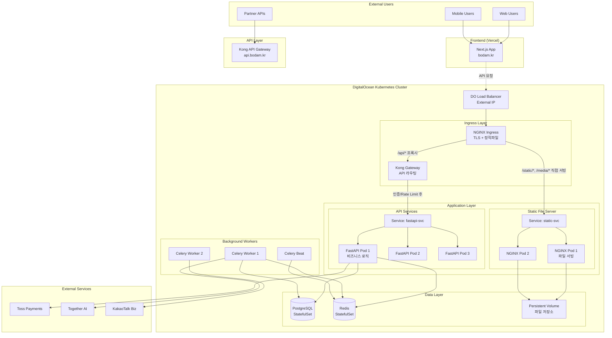
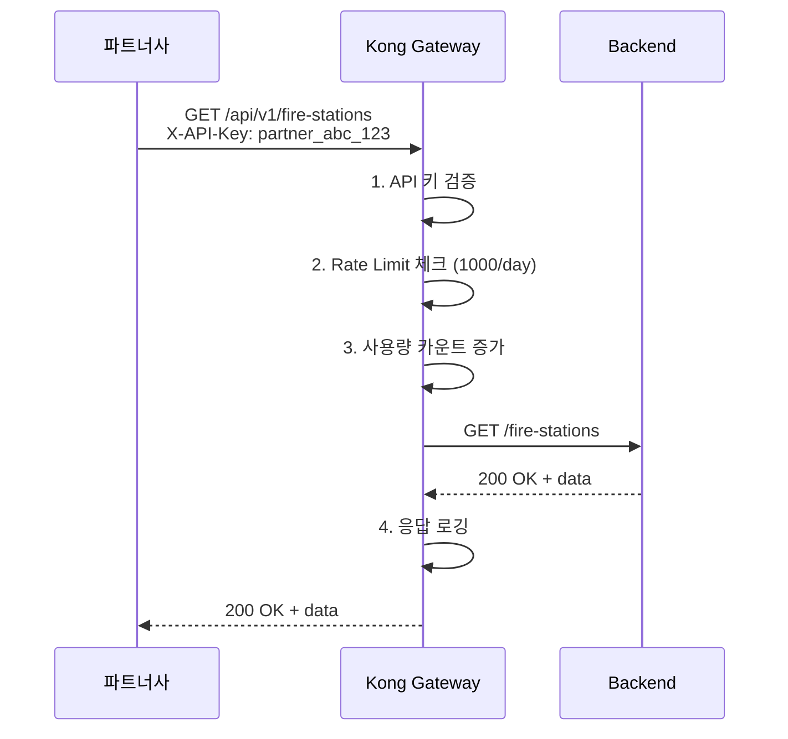
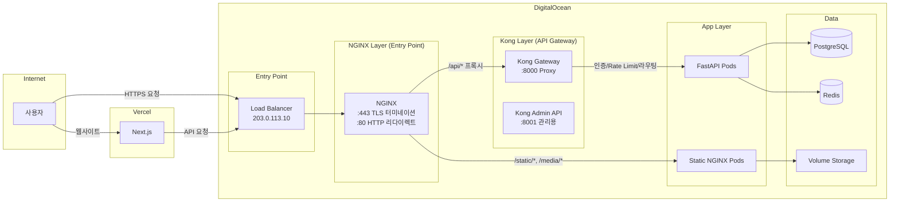

# 보담(BoDam) 배포 전략 - API Gateway 포함 버전

> **작성일**: 2025-10-26 (최종 업데이트)
> **대상 환경**: Production (확장성 고려)
> **주요 기술**: Vercel, DigitalOcean, Kubernetes, Kong Gateway 3.5, NGINX 1.25, Selenium 4.15+
> **최신 업데이트**: Kong Gateway + Selenium 크롤러 마이그레이션 완료, DB/HTTP 연결 풀 최적화

---

## 📋 목차

1. [확장성을 고려한 아키텍처](#확장성을-고려한-아키텍처)
2. [API Gateway 도입 이유](#api-gateway-도입-이유)
3. [전체 시스템 구성도](#전체-시스템-구성도)
4. [최신 변경사항](#최신-변경사항)
5. [단계별 구축 가이드](#단계별-구축-가이드)
6. [실전 설정 파일](#실전-설정-파일)
7. [DB 및 HTTP 연결 풀 설정](#db-및-http-연결-풀-설정)
8. [운영 및 모니터링](#운영-및-모니터링)

---

## 확장성을 고려한 아키텍처

### 최종 아키텍처



---

## 최신 변경사항

### 2025년 10월 주요 업데이트

#### 1. Kong Gateway 3.5 DB-less 모드 적용
- **변경**: PostgreSQL 기반 → DB-less (Declarative Config) 모드
- **이유**: 설정 관리 간소화, 배포 속도 향상, 장애 포인트 제거
- **적용**: ConfigMap 기반 선언적 설정 (`kong-config.yaml`)

```yaml
# Kong DB-less 설정
KONG_DATABASE=off
KONG_DECLARATIVE_CONFIG=/kong.yaml
```

#### 2. Selenium 4.15+ 동적 크롤러 전환
- **변경**: BeautifulSoup4 정적 크롤러 → Selenium WebDriver
- **이유**: JavaScript 렌더링 콘텐츠 수집 필요 (뉴스, 재난 정보)
- **기술 스택**: Chrome headless + WebDriver Manager + Selenium Grid

```python
# Selenium 크롤러 서비스 구조
backend/src/services/crawler/
├── selenium_crawler.py      # Selenium WebDriver 관리
├── browser_pool.py          # 브라우저 인스턴스 풀링
└── wait_strategies.py       # 동적 콘텐츠 대기 전략
```

#### 3. DB/HTTP 연결 풀 최적화
- **DB 연결 풀**: SQLAlchemy 2.0 비동기 엔진 설정
  - `pool_size=10`, `max_overflow=20`, `pool_timeout=0.4s`
  - `pool_pre_ping=true` (끊어진 연결 자동 감지/재생성)
  - `pool_recycle=3600s` (1시간마다 연결 재활용)

- **HTTP 연결 풀**: httpx 클라이언트 풀링
  - 일반 API: `max_connections=100`, `connect_timeout=4s`, `read_timeout=8s`
  - 결제 API: `connect_timeout=180s`, `read_timeout=180s`
  - Keep-Alive: `max_keepalive_connections=20`, `keepalive_expiry=60s`

- **재시도 정책**: tenacity 기반
  - 최대 3회 재시도 (GET 요청), 간격 4초
  - POST 요청: 멱등성 키 필수 (idempotency-key)
  - 결제 API 제외 도메인: `api.tosspayments.com`, `pay.naver.com`

```bash
# 환경 변수 예시
DB_POOL_SIZE=10
DB_MAX_OVERFLOW=20
DB_POOL_TIMEOUT=0.4

HTTP_MAX_CONNECTIONS=100
HTTP_CONNECT_TIMEOUT=4.0
HTTP_READ_TIMEOUT=8.0

RETRY_MAX_ATTEMPTS=3
RETRY_INTERVAL=4.0
RETRY_EXCLUDED_DOMAINS=api.tosspayments.com,pay.naver.com
```

#### 4. NGINX 역할 재정의
- **이전**: API 라우팅 + 정적 파일 서빙 + TLS 터미네이션
- **현재**: TLS 터미네이션 + 정적 파일 서빙 (API 라우팅은 Kong으로 이관)
- **정적 파일**: `/static/`, `/media/`, `/receipts/` 직접 서빙 (Kong 우회)

```nginx
# NGINX 정적 파일 설정
location /static/ {
    alias /var/www/static/;
    expires 1y;
    add_header Cache-Control "public, immutable";
}

location /media/ {
    alias /var/www/media/;
    expires 30d;
    add_header Cache-Control "public";
}
```

#### 5. 관측성 강화
- OpenTelemetry (OTEL) 트레이싱 추가
- Prometheus + Grafana 메트릭 수집
- Loki + Promtail 로그 집계
- Tempo 분산 트레이싱

```yaml
# Backend Deployment에 OTEL 설정 추가
env:
  - name: OTEL_EXPORTER_OTLP_ENDPOINT
    value: http://otel-collector.observability.svc.cluster.local:4318
  - name: OTEL_SERVICE_NAME
    value: backend-api
```

---

## API Gateway 도입 이유

### 1. **확장성 확보**

#### 마이크로서비스 전환 대비
```
현재 아키텍처:
  Client → NGINX (TLS 터미네이션) → Kong Gateway (인증/라우팅) → FastAPI

역할 분담:
  - NGINX: HTTPS 처리, 정적 파일 직접 서빙
  - Kong Gateway: API 인증, Rate Limiting, 라우팅
  - FastAPI: 비즈니스 로직

6개월 후 (마이크로서비스):
  Client → NGINX (TLS) → Kong Gateway → ┌─ User Service (FastAPI)
                                         ├─ Donation Service (FastAPI)
                                         ├─ Payment Service (FastAPI)
                                         ├─ Notification Service (Node.js)
                                         └─ Analytics Service (Python)
```

**장점**: Kong Gateway 설정만 변경하면 서비스 추가 가능. NGINX는 변경 불필요.

### 2. **외부 파트너 API 제공 준비**



### 3. **고급 기능 지원**

| 기능 | Kong Gateway | NGINX만 사용 시 |
|------|---------------|-----------------|
| **사용자별 Rate Limiting** | ✅ Consumer 단위 | ❌ IP별만 가능 |
| **API 키 관리** | ✅ 내장 플러그인 | ❌ 직접 구현 필요 |
| **API 버전 관리** | ✅ /v1, /v2 자동 라우팅 | ⚠️ 수동 설정 |
| **실시간 분석** | ✅ Admin API | ❌ 로그 파싱 필요 |
| **플러그인 생태계** | ✅ 50+ 공식 플러그인 | ❌ Lua 직접 작성 |
| **TLS 터미네이션** | ⚠️ 가능하나 NGINX에 위임 | ✅ 최적화됨 |
| **정적 파일 서빙** | ⚠️ 가능하나 NGINX에 위임 | ✅ 최적화됨 |

**결론**: API 라우팅은 Kong, TLS와 정적 파일은 NGINX가 담당하여 각자의 강점을 살림.

---

## 전체 시스템 구성도

### 네트워크 플로우



---

## DB 및 HTTP 연결 풀 설정

### DB 연결 풀 (SQLAlchemy 2.0)

#### 환경 변수 설정

```bash
# .env 파일 또는 Kubernetes Secret
DB_POOL_SIZE=10                    # 기본 연결 풀 크기
DB_MAX_OVERFLOW=20                 # 최대 추가 연결 수
DB_POOL_RECYCLE=3600               # 연결 재활용 시간 (초)
DB_POOL_PRE_PING=true              # 연결 유효성 사전 검증
DB_POOL_TIMEOUT=0.4                # 연결 대기 타임아웃 (초)
```

#### Kubernetes Secret 적용

```bash
# Secret 생성
kubectl create secret generic db-pool-config \
  --from-literal=DB_POOL_SIZE=10 \
  --from-literal=DB_MAX_OVERFLOW=20 \
  --from-literal=DB_POOL_RECYCLE=3600 \
  --from-literal=DB_POOL_PRE_PING=true \
  --from-literal=DB_POOL_TIMEOUT=0.4

# Backend Deployment에 Secret 마운트
# infra/k8s/backend/deployment.yaml에 추가:
env:
  - name: DB_POOL_SIZE
    valueFrom:
      secretKeyRef:
        name: db-pool-config
        key: DB_POOL_SIZE
```

#### 연결 풀 모니터링

```python
# backend/src/database/pool_metrics.py
from sqlalchemy import event
from prometheus_client import Gauge

pool_size = Gauge('db_pool_size', 'Current pool size')
checked_out = Gauge('db_pool_checked_out', 'Checked out connections')

@event.listens_for(engine.pool, "checkout")
def receive_checkout(dbapi_conn, connection_record, connection_proxy):
    pool_size.set(engine.pool.size())
    checked_out.set(engine.pool.checkedout())
```

### HTTP 연결 풀 (httpx)

#### 환경 변수 설정

```bash
# 일반 API용
HTTP_MAX_CONNECTIONS=100           # 최대 동시 연결 수
HTTP_MAX_KEEPALIVE_CONNECTIONS=20  # Keep-Alive 연결 수
HTTP_KEEPALIVE_EXPIRY=60.0         # Keep-Alive 유효 시간 (초)

# 타임아웃 설정
HTTP_CONNECT_TIMEOUT=4.0           # 연결 타임아웃 (초)
HTTP_READ_TIMEOUT=8.0              # 읽기 타임아웃 (초)
HTTP_WRITE_TIMEOUT=10.0            # 쓰기 타임아웃 (초)
HTTP_POOL_TIMEOUT=10.0             # 연결 풀 대기 타임아웃 (초)

# 결제 API용 (긴 타임아웃)
HTTP_PAYMENT_CONNECT_TIMEOUT=180.0
HTTP_PAYMENT_READ_TIMEOUT=180.0
```

#### 재시도 정책 설정

```bash
RETRY_MAX_ATTEMPTS=3               # 최대 재시도 횟수
RETRY_INTERVAL=4.0                 # 재시도 간격 (초)
RETRY_EXCLUDED_DOMAINS=api.tosspayments.com,pay.naver.com  # 재시도 제외 도메인
```

#### Kubernetes ConfigMap 적용

```bash
# ConfigMap 생성
kubectl create configmap http-pool-config \
  --from-literal=HTTP_MAX_CONNECTIONS=100 \
  --from-literal=HTTP_CONNECT_TIMEOUT=4.0 \
  --from-literal=HTTP_READ_TIMEOUT=8.0 \
  --from-literal=RETRY_MAX_ATTEMPTS=3 \
  --from-literal=RETRY_INTERVAL=4.0

# Backend Deployment에 ConfigMap 마운트
envFrom:
  - configMapRef:
      name: http-pool-config
```

#### HTTP 클라이언트 사용 예시

```python
# backend/src/integrations/http_client.py
from httpx import AsyncClient, Limits, Timeout

async def get_client(client_type: str = "general"):
    """HTTP 클라이언트 팩토리"""
    if client_type == "payment":
        timeout = Timeout(
            connect=float(os.getenv("HTTP_PAYMENT_CONNECT_TIMEOUT", 180.0)),
            read=float(os.getenv("HTTP_PAYMENT_READ_TIMEOUT", 180.0))
        )
    else:
        timeout = Timeout(
            connect=float(os.getenv("HTTP_CONNECT_TIMEOUT", 4.0)),
            read=float(os.getenv("HTTP_READ_TIMEOUT", 8.0)),
            write=float(os.getenv("HTTP_WRITE_TIMEOUT", 10.0)),
            pool=float(os.getenv("HTTP_POOL_TIMEOUT", 10.0))
        )

    limits = Limits(
        max_connections=int(os.getenv("HTTP_MAX_CONNECTIONS", 100)),
        max_keepalive_connections=int(os.getenv("HTTP_MAX_KEEPALIVE_CONNECTIONS", 20)),
        keepalive_expiry=float(os.getenv("HTTP_KEEPALIVE_EXPIRY", 60.0))
    )

    return AsyncClient(timeout=timeout, limits=limits)
```

### 성능 테스트

```bash
# K6 부하 테스트 실행
k6 run backend/tests/performance/connection_pool_load_test.js

# 예상 결과:
# - 100 VUs 부하 시 95% 요청이 5초 이내 응답
# - 에러율 1% 미만
# - DB 연결 풀 타임아웃 없음
# - HTTP 연결 풀 타임아웃 없음
```

---

## 단계별 구축 가이드

### Phase 1: Kubernetes 클러스터 생성

```bash
# doctl 설치 및 인증
snap install doctl
doctl auth init

# Kubernetes 클러스터 생성 (서울 리전 근처 - 싱가포르)
doctl kubernetes cluster create bodam-prod \
  --region sgp1 \
  --version 1.28.2-do.0 \
  --node-pool "name=app-pool;size=s-4vcpu-8gb;count=3;auto-scale=true;min-nodes=2;max-nodes=5" \
  --node-pool "name=worker-pool;size=s-2vcpu-4gb;count=2;auto-scale=true;min-nodes=1;max-nodes=4"

# kubeconfig 다운로드
doctl kubernetes cluster kubeconfig save bodam-prod

# 클러스터 확인
kubectl get nodes
```

---

### Phase 2: Kong Gateway 설치 (DB-less 모드)

#### 2-1. Kong 설정 파일 준비

```bash
# Kong ConfigMap 생성 (Declarative Config)
kubectl apply -f infra/k8s/kong/kong-configmap.yaml

# Kong Gateway Deployment 배포
kubectl apply -f infra/k8s/kong/kong-deployment.yaml

# Kong Service 생성
kubectl apply -f infra/k8s/kong/kong-service.yaml
```

#### 2-2. Kong 설정 파일 예시

`infra/k8s/kong/kong-configmap.yaml`:
```yaml
apiVersion: v1
kind: ConfigMap
metadata:
  name: kong-config
data:
  kong.yaml: |
    _format_version: "3.0"

    services:
      - name: backend-api
        url: http://bodam-backend.default.svc.cluster.local:80
        routes:
          - name: api-route
            paths:
              - /api
            strip_path: false
        plugins:
          - name: rate-limiting
            config:
              minute: 200
              policy: local
          - name: cors
            config:
              origins:
                - https://bodam.kr
              credentials: true
```

#### 2-3. Kong 설치 확인

```bash
# Kong Pod 상태 확인
kubectl get pods -l app=kong

# Kong 설정 검증
kubectl exec -it <kong-pod-name> -- kong config parse /kong.yaml

# Kong Admin API 접속 (Port Forward)
kubectl port-forward svc/kong-admin-service 8001:8001

# Kong 상태 확인
curl http://localhost:8001/status
```


---

### Phase 3: NGINX Ingress 설치

```bash
# NGINX Deployment 및 Service 배포
kubectl apply -f infra/k8s/nginx/nginx-configmap.yaml
kubectl apply -f infra/k8s/nginx/nginx-deployment.yaml
kubectl apply -f infra/k8s/nginx/nginx-service.yaml

# TLS 인증서 Secret 생성 (Let's Encrypt 또는 수동)
kubectl apply -f infra/k8s/nginx/tls-certificate.yaml

# 설치 확인
kubectl get pods -l app=nginx-ingress
kubectl get svc nginx-ingress-service
```

---

### Phase 4: cert-manager 설치 (SSL 인증서)

```bash
# cert-manager 설치
kubectl apply -f https://github.com/cert-manager/cert-manager/releases/download/v1.13.0/cert-manager.yaml

# Let's Encrypt Issuer 생성
cat <<EOF | kubectl apply -f -
apiVersion: cert-manager.io/v1
kind: ClusterIssuer
metadata:
  name: letsencrypt-prod
spec:
  acme:
    server: https://acme-v02.api.letsencrypt.org/directory
    email: admin@bodam.kr
    privateKeySecretRef:
      name: letsencrypt-prod
    solvers:
    - http01:
        ingress:
          class: kong
EOF
```

---

## 실전 설정 파일

### 1. Namespace 및 Secrets

```bash
# Namespace 생성
kubectl create namespace bodam

# Database Credentials
kubectl create secret generic db-credentials \
  --from-literal=username=bodam_user \
  --from-literal=password=$(openssl rand -base64 32) \
  --from-literal=database=bodam \
  -n bodam

# API Keys
kubectl create secret generic api-keys \
  --from-literal=toss_secret_key=YOUR_TOSS_SECRET \
  --from-literal=together_api_key=YOUR_TOGETHER_KEY \
  --from-literal=kakao_rest_api_key=YOUR_KAKAO_KEY \
  -n bodam

# JWT Secret
kubectl create secret generic jwt-secret \
  --from-literal=secret=$(openssl rand -base64 64) \
  -n bodam
```

---

### 2. FastAPI Deployment (최신 버전)

```yaml
# infra/k8s/backend/deployment.yaml
apiVersion: apps/v1
kind: Deployment
metadata:
  name: bodam-backend
spec:
  replicas: 2
  selector:
    matchLabels:
      app: bodam-backend
  template:
    metadata:
      labels:
        app: bodam-backend
    spec:
      containers:
        - name: backend
          image: ghcr.io/bodam/backend:latest
          imagePullPolicy: Always
          ports:
            - containerPort: 8000
              name: http
          env:
            # DB 연결
            - name: DATABASE_URL
              valueFrom:
                secretKeyRef:
                  name: bodam-secrets
                  key: database_url

            # DB 연결 풀 설정
            - name: DB_POOL_SIZE
              value: "10"
            - name: DB_MAX_OVERFLOW
              value: "20"
            - name: DB_POOL_TIMEOUT
              value: "0.4"
            - name: DB_POOL_PRE_PING
              value: "true"
            - name: DB_POOL_RECYCLE
              value: "3600"

            # Redis 연결
            - name: REDIS_CACHE_URL
              value: redis://redis-cache-service:6379/0
            - name: CELERY_BROKER_URL
              value: redis://redis-queue-service:6379/0
            - name: CELERY_RESULT_BACKEND
              value: redis://redis-queue-service:6379/1

            # HTTP 연결 풀 설정
            - name: HTTP_MAX_CONNECTIONS
              value: "100"
            - name: HTTP_CONNECT_TIMEOUT
              value: "4.0"
            - name: HTTP_READ_TIMEOUT
              value: "8.0"
            - name: RETRY_MAX_ATTEMPTS
              value: "3"
            - name: RETRY_INTERVAL
              value: "4.0"

            # 관측성 (OpenTelemetry)
            - name: OTEL_EXPORTER_OTLP_ENDPOINT
              value: http://otel-collector.observability.svc.cluster.local:4318
            - name: OTEL_SERVICE_NAME
              value: backend-api
            - name: OTEL_RESOURCE_ATTRIBUTES
              value: service.namespace=bodam,deployment.environment=production
            - name: OTEL_TRACES_SAMPLER
              value: always_on

          resources:
            requests:
              memory: "512Mi"
              cpu: "500m"
            limits:
              memory: "1Gi"
              cpu: "1000m"

          readinessProbe:
            httpGet:
              path: /readyz
              port: 8000
            initialDelaySeconds: 5
            periodSeconds: 10

          livenessProbe:
            httpGet:
              path: /healthz
              port: 8000
            initialDelaySeconds: 10
            periodSeconds: 20
---
apiVersion: v1
kind: Service
metadata:
  name: bodam-backend
spec:
  selector:
    app: bodam-backend
  ports:
    - name: http
      port: 80
      targetPort: 8000
  type: ClusterIP
```

---

### 3. NGINX Deployment (TLS 터미네이션 + 정적 파일 전용)

**역할**: API 라우팅은 Kong Gateway가 담당하며, NGINX는 TLS 터미네이션과 정적 파일 서빙만 수행

```yaml
# infra/k8s/nginx/nginx-configmap.yaml
apiVersion: v1
kind: ConfigMap
metadata:
  name: nginx-config
data:
  nginx.conf: |
    user nginx;
    worker_processes auto;
    error_log /var/log/nginx/error.log warn;
    pid /var/run/nginx.pid;

    events {
      worker_connections 1024;
    }

    http {
      include /etc/nginx/mime.types;
      default_type application/octet-stream;

      log_format main '$remote_addr - $remote_user [$time_local] "$request" '
                      '$status $body_bytes_sent "$http_referer" '
                      '"$http_user_agent" "$http_x_forwarded_for"';

      access_log /var/log/nginx/access.log main;
      sendfile on;
      tcp_nopush on;
      keepalive_timeout 65;
      gzip on;
      gzip_types text/plain text/css application/json application/javascript text/xml application/xml;

      # HTTPS 서버 (TLS 터미네이션)
      server {
        listen 443 ssl http2;
        server_name bodam.kr api.bodam.kr;

        # TLS 설정
        ssl_certificate /etc/nginx/ssl/tls.crt;
        ssl_certificate_key /etc/nginx/ssl/tls.key;
        ssl_protocols TLSv1.2 TLSv1.3;
        ssl_ciphers HIGH:!aNULL:!MD5;
        ssl_prefer_server_ciphers on;

        # 보안 헤더
        add_header Strict-Transport-Security "max-age=31536000; includeSubDomains" always;
        add_header X-Content-Type-Options "nosniff" always;
        add_header X-Frame-Options "DENY" always;

        # API 요청 → Kong Gateway로 프록시
        location /api/ {
          proxy_pass http://kong-proxy-service:8000;
          proxy_set_header Host $host;
          proxy_set_header X-Real-IP $remote_addr;
          proxy_set_header X-Forwarded-For $proxy_add_x_forwarded_for;
          proxy_set_header X-Forwarded-Proto $scheme;
          proxy_http_version 1.1;
          proxy_set_header Connection "";
        }

        # 정적 파일 직접 서빙 (Kong 우회)
        location /static/ {
          alias /var/www/static/;
          expires 1y;
          add_header Cache-Control "public, immutable";
          add_header Access-Control-Allow-Origin "*";
          autoindex off;
        }

        # 미디어 파일 서빙
        location /media/ {
          alias /var/www/media/;
          expires 30d;
          add_header Cache-Control "public";
          autoindex off;
        }

        # 영수증 PDF 서빙
        location /receipts/ {
          alias /var/www/receipts/;
          expires 30d;
          add_header Cache-Control "public";
          add_header Content-Disposition "attachment";
        }

        # Health check
        location /health {
          access_log off;
          return 200 "healthy\n";
          add_header Content-Type text/plain;
        }
      }

      # HTTP → HTTPS 리다이렉트
      server {
        listen 80;
        server_name bodam.kr api.bodam.kr;

        location / {
          return 301 https://$host$request_uri;
        }
      }
    }
---
apiVersion: apps/v1
kind: Deployment
metadata:
  name: static-nginx
  namespace: bodam
spec:
  replicas: 2
  selector:
    matchLabels:
      app: static-nginx
  template:
    metadata:
      labels:
        app: static-nginx
    spec:
      containers:
      - name: nginx
        image: nginx:1.25-alpine
        ports:
        - containerPort: 80
        volumeMounts:
        - name: nginx-config
          mountPath: /etc/nginx/nginx.conf
          subPath: nginx.conf
        - name: media-storage
          mountPath: /data
        resources:
          requests:
            memory: "128Mi"
            cpu: "100m"
          limits:
            memory: "256Mi"
            cpu: "200m"
      volumes:
      - name: nginx-config
        configMap:
          name: nginx-static-config
      - name: media-storage
        persistentVolumeClaim:
          claimName: media-pvc
---
apiVersion: v1
kind: Service
metadata:
  name: static-nginx-service
  namespace: bodam
spec:
  selector:
    app: static-nginx
  ports:
  - protocol: TCP
    port: 80
    targetPort: 80
  type: ClusterIP
---
apiVersion: v1
kind: PersistentVolumeClaim
metadata:
  name: media-pvc
  namespace: bodam
spec:
  accessModes:
    - ReadWriteMany
  resources:
    requests:
      storage: 50Gi
  storageClassName: do-block-storage
```

---

### 4. Kong Ingress 설정 (Main Entry Point)

```yaml
# k8s/kong-ingress.yaml
apiVersion: networking.k8s.io/v1
kind: Ingress
metadata:
  name: kong-main-ingress
  namespace: bodam
  annotations:
    cert-manager.io/cluster-issuer: "letsencrypt-prod"
    konghq.com/strip-path: "false"
    konghq.com/plugins: rate-limiting-global, cors-global, logging-global
spec:
  ingressClassName: kong
  tls:
  - hosts:
    - api.bodam.kr
    secretName: api-bodam-kr-tls
  rules:
  - host: api.bodam.kr
    http:
      paths:
      # 모든 요청을 NGINX Ingress로 전달
      - path: /
        pathType: Prefix
        backend:
          service:
            name: nginx-ingress-controller
            port:
              number: 80
            namespace: ingress-nginx
```

---

### 5. Kong Plugins 설정

```yaml
# k8s/kong-plugins.yaml

# 1. Rate Limiting (전역)
apiVersion: configuration.konghq.com/v1
kind: KongPlugin
metadata:
  name: rate-limiting-global
  namespace: bodam
config:
  minute: 100
  hour: 5000
  policy: local
  limit_by: consumer
  fault_tolerant: true
plugin: rate-limiting
---
# 2. CORS (전역)
apiVersion: configuration.konghq.com/v1
kind: KongPlugin
metadata:
  name: cors-global
  namespace: bodam
config:
  origins:
    - https://bodam.kr
    - https://bodam.vercel.app
    - http://localhost:3000
  methods:
    - GET
    - POST
    - PUT
    - DELETE
    - PATCH
    - OPTIONS
  headers:
    - Accept
    - Accept-Language
    - Authorization
    - Content-Type
    - X-Requested-With
  exposed_headers:
    - X-Auth-Token
  credentials: true
  max_age: 3600
plugin: cors
---
# 3. HTTP Logging
apiVersion: configuration.konghq.com/v1
kind: KongPlugin
metadata:
  name: logging-global
  namespace: bodam
config:
  http_endpoint: http://logstash.monitoring.svc.cluster.local:5000
  method: POST
  timeout: 1000
  keepalive: 60000
plugin: http-log
---
# 4. JWT Authentication (선택적)
apiVersion: configuration.konghq.com/v1
kind: KongPlugin
metadata:
  name: jwt-auth
  namespace: bodam
config:
  key_claim_name: iss
  secret_is_base64: false
  uri_param_names:
    - jwt
  cookie_names:
    - bodam_session
plugin: jwt
---
# 5. API Key Authentication (파트너용)
apiVersion: configuration.konghq.com/v1
kind: KongPlugin
metadata:
  name: key-auth-partner
  namespace: bodam
config:
  key_names:
    - apikey
    - x-api-key
  hide_credentials: true
plugin: key-auth
```

---

### 6. NGINX Ingress 설정 (Internal Routing)

```yaml
# k8s/nginx-ingress.yaml
apiVersion: networking.k8s.io/v1
kind: Ingress
metadata:
  name: nginx-internal-routing
  namespace: bodam
  annotations:
    nginx.ingress.kubernetes.io/rewrite-target: /$2
    nginx.ingress.kubernetes.io/use-regex: "true"
spec:
  ingressClassName: nginx
  rules:
  - http:
      paths:
      # API 요청 → FastAPI
      - path: /api(/|$)(.*)
        pathType: Prefix
        backend:
          service:
            name: fastapi-service
            port:
              number: 8000

      # 파일 다운로드 → Static NGINX
      - path: /media(/|$)(.*)
        pathType: Prefix
        backend:
          service:
            name: static-nginx-service
            port:
              number: 80

      # 영수증 다운로드 → Static NGINX
      - path: /receipts(/|$)(.*)
        pathType: Prefix
        backend:
          service:
            name: static-nginx-service
            port:
              number: 80

      # Health check
      - path: /health
        pathType: Exact
        backend:
          service:
            name: fastapi-service
            port:
              number: 8000
```

---

### 7. PostgreSQL StatefulSet

```yaml
# k8s/postgresql.yaml
apiVersion: v1
kind: Service
metadata:
  name: postgresql
  namespace: bodam
spec:
  selector:
    app: postgresql
  ports:
  - port: 5432
  clusterIP: None
---
apiVersion: apps/v1
kind: StatefulSet
metadata:
  name: postgresql
  namespace: bodam
spec:
  serviceName: postgresql
  replicas: 1
  selector:
    matchLabels:
      app: postgresql
  template:
    metadata:
      labels:
        app: postgresql
    spec:
      containers:
      - name: postgresql
        image: postgres:15-alpine
        ports:
        - containerPort: 5432
          name: postgres
        env:
        - name: POSTGRES_DB
          valueFrom:
            secretKeyRef:
              name: db-credentials
              key: database
        - name: POSTGRES_USER
          valueFrom:
            secretKeyRef:
              name: db-credentials
              key: username
        - name: POSTGRES_PASSWORD
          valueFrom:
            secretKeyRef:
              name: db-credentials
              key: password
        - name: PGDATA
          value: /var/lib/postgresql/data/pgdata
        volumeMounts:
        - name: postgresql-storage
          mountPath: /var/lib/postgresql/data
        resources:
          requests:
            memory: "1Gi"
            cpu: "500m"
          limits:
            memory: "2Gi"
            cpu: "1000m"
  volumeClaimTemplates:
  - metadata:
      name: postgresql-storage
    spec:
      accessModes: ["ReadWriteOnce"]
      storageClassName: do-block-storage
      resources:
        requests:
          storage: 20Gi
```

---

### 8. Redis StatefulSet

```yaml
# k8s/redis.yaml
apiVersion: v1
kind: Service
metadata:
  name: redis-service
  namespace: bodam
spec:
  selector:
    app: redis
  ports:
  - port: 6379
  clusterIP: None
---
apiVersion: apps/v1
kind: StatefulSet
metadata:
  name: redis
  namespace: bodam
spec:
  serviceName: redis-service
  replicas: 1
  selector:
    matchLabels:
      app: redis
  template:
    metadata:
      labels:
        app: redis
    spec:
      containers:
      - name: redis
        image: redis:7-alpine
        ports:
        - containerPort: 6379
          name: redis
        command:
        - redis-server
        - --appendonly yes
        - --requirepass $(REDIS_PASSWORD)
        env:
        - name: REDIS_PASSWORD
          valueFrom:
            secretKeyRef:
              name: redis-credentials
              key: password
        volumeMounts:
        - name: redis-storage
          mountPath: /data
        resources:
          requests:
            memory: "256Mi"
            cpu: "250m"
          limits:
            memory: "512Mi"
            cpu: "500m"
  volumeClaimTemplates:
  - metadata:
      name: redis-storage
    spec:
      accessModes: ["ReadWriteOnce"]
      storageClassName: do-block-storage
      resources:
        requests:
          storage: 10Gi
```

---

### 9. Celery Workers

```yaml
# k8s/celery-workers.yaml
apiVersion: apps/v1
kind: Deployment
metadata:
  name: celery-worker
  namespace: bodam
spec:
  replicas: 2
  selector:
    matchLabels:
      app: celery-worker
  template:
    metadata:
      labels:
        app: celery-worker
    spec:
      containers:
      - name: celery
        image: registry.digitalocean.com/bodam-registry/backend:latest
        command:
        - celery
        - -A
        - src.worker
        - worker
        - --loglevel=info
        - --concurrency=4
        env:
        - name: DATABASE_URL
          valueFrom:
            secretKeyRef:
              name: db-credentials
              key: url
        - name: REDIS_URL
          value: "redis://redis-service:6379/0"
        - name: CELERY_BROKER_URL
          value: "redis://redis-service:6379/1"
        resources:
          requests:
            memory: "512Mi"
            cpu: "500m"
          limits:
            memory: "1Gi"
            cpu: "1000m"
---
apiVersion: apps/v1
kind: Deployment
metadata:
  name: celery-beat
  namespace: bodam
spec:
  replicas: 1
  selector:
    matchLabels:
      app: celery-beat
  template:
    metadata:
      labels:
        app: celery-beat
    spec:
      containers:
      - name: celery-beat
        image: registry.digitalocean.com/bodam-registry/backend:latest
        command:
        - celery
        - -A
        - src.worker
        - beat
        - --loglevel=info
        env:
        - name: REDIS_URL
          value: "redis://redis-service:6379/1"
        resources:
          requests:
            memory: "128Mi"
            cpu: "100m"
```

---

## 운영 및 모니터링

### 1. Kong Consumer 생성 (파트너 API 키)

```bash
# 파트너사 등록
curl -X POST http://localhost:8001/consumers \
  --data "username=partner-company-a" \
  --data "custom_id=PARTNER_A"

# API 키 발급
curl -X POST http://localhost:8001/consumers/partner-company-a/key-auth \
  --data "key=pk_live_partner_a_abc123def456"

# Rate Limiting 설정 (파트너별)
curl -X POST http://localhost:8001/consumers/partner-company-a/plugins \
  --data "name=rate-limiting" \
  --data "config.minute=1000" \
  --data "config.hour=50000" \
  --data "config.policy=local"
```

### 2. 파트너사 API 사용 예시

```bash
# 파트너사가 API 호출
curl -X GET https://api.bodam.kr/api/fire-stations \
  -H "x-api-key: pk_live_partner_a_abc123def456"

# Kong이 자동으로:
# 1. API 키 검증
# 2. Rate Limit 체크
# 3. 로깅
# 4. FastAPI로 프록시
```

### 3. Prometheus + Grafana 모니터링

```bash
# Prometheus Stack 설치
helm repo add prometheus-community https://prometheus-community.github.io/helm-charts
helm install prometheus prometheus-community/kube-prometheus-stack \
  --namespace monitoring \
  --create-namespace

# Grafana 접속
kubectl port-forward -n monitoring svc/prometheus-grafana 3000:80

# http://localhost:3000
# ID: admin
# PW: prom-operator
```

### 4. Kong Admin API를 통한 모니터링

```bash
# API 통계 조회
curl http://localhost:8001/status | jq

# 현재 설정된 서비스
curl http://localhost:8001/services | jq

# 플러그인 목록
curl http://localhost:8001/plugins | jq

# Consumer 목록
curl http://localhost:8001/consumers | jq
```

---

## 배포 자동화 (CI/CD)

### GitHub Actions - Backend 배포

```yaml
# .github/workflows/deploy-backend.yml
name: Deploy Backend to Kubernetes

on:
  push:
    branches: [main]
    paths:
      - 'backend/**'

env:
  REGISTRY: registry.digitalocean.com/bodam-registry
  IMAGE_NAME: backend

jobs:
  build-and-deploy:
    runs-on: ubuntu-latest
    steps:
      - name: Checkout code
        uses: actions/checkout@v3

      - name: Install doctl
        uses: digitalocean/action-doctl@v2
        with:
          token: ${{ secrets.DIGITALOCEAN_ACCESS_TOKEN }}

      - name: Build Docker image
        run: |
          cd backend
          docker build -t ${{ env.REGISTRY }}/${{ env.IMAGE_NAME }}:${{ github.sha }} .
          docker tag ${{ env.REGISTRY }}/${{ env.IMAGE_NAME }}:${{ github.sha }} ${{ env.REGISTRY }}/${{ env.IMAGE_NAME }}:latest

      - name: Log in to DO Container Registry
        run: doctl registry login --expiry-seconds 600

      - name: Push image to DO Registry
        run: |
          docker push ${{ env.REGISTRY }}/${{ env.IMAGE_NAME }}:${{ github.sha }}
          docker push ${{ env.REGISTRY }}/${{ env.IMAGE_NAME }}:latest

      - name: Save kubeconfig
        run: doctl kubernetes cluster kubeconfig save bodam-prod

      - name: Deploy to Kubernetes
        run: |
          kubectl set image deployment/fastapi-backend \
            fastapi=${{ env.REGISTRY }}/${{ env.IMAGE_NAME }}:${{ github.sha }} \
            -n bodam

          kubectl rollout status deployment/fastapi-backend -n bodam

          kubectl set image deployment/celery-worker \
            celery=${{ env.REGISTRY }}/${{ env.IMAGE_NAME }}:${{ github.sha }} \
            -n bodam

          kubectl rollout status deployment/celery-worker -n bodam

      - name: Verify deployment
        run: |
          kubectl get pods -n bodam
          kubectl get svc -n bodam
```

---

## 비용 분석

### 월간 예상 비용

| 항목 | 스펙 | 수량 | 단가 | 합계 |
|------|------|------|------|------|
| **Vercel Pro** | Frontend hosting | 1 | $20 | $20 |
| **DO Kubernetes** | s-4vcpu-8gb | 3 nodes | $48 | $144 |
| **DO Kubernetes** | s-2vcpu-4gb (worker) | 2 nodes | $24 | $48 |
| **DO Load Balancer** | - | 1 | $12 | $12 |
| **DO Block Storage** | PostgreSQL | 20GB | $2 | $2 |
| **DO Block Storage** | Redis | 10GB | $1 | $1 |
| **DO Block Storage** | Media files | 50GB | $5 | $5 |
| **DO Container Registry** | - | 5GB | $5 | $5 |
| **도메인** | .kr | 1/year | $3/mo | $3 |
| **Total** | | | | **$240/월** |

### 비용 최적화 옵션

#### 옵션 1: Managed Database 사용 (권장)
```
Self-hosted PostgreSQL 제거 → DO Managed PostgreSQL ($15/mo)
- 자동 백업
- 자동 업데이트
- 고가용성

총 비용: $240 → $255/월 (관리 편의성 ↑)
```

#### 옵션 2: 개발/스테이징 환경
```
Node 축소: s-2vcpu-4gb x 2
총 비용: $240 → $80/월
```

---

## 트러블슈팅

### 1. Kong 연결 안 됨
```bash
# Kong Proxy 확인
kubectl logs -n kong deployment/kong-kong -f

# Kong Admin API 확인
kubectl port-forward -n kong svc/kong-admin 8001:8001
curl http://localhost:8001/status

# Ingress 확인
kubectl describe ingress kong-main-ingress -n bodam
```

### 2. NGINX Ingress 라우팅 실패
```bash
# NGINX Logs 확인
kubectl logs -n ingress-nginx deployment/nginx-ingress-controller -f

# Ingress 상태
kubectl describe ingress nginx-internal-routing -n bodam

# Service 확인
kubectl get svc -n bodam
```

### 3. FastAPI Pod 재시작 반복
```bash
# Pod 상태 확인
kubectl describe pod <pod-name> -n bodam

# 로그 확인
kubectl logs <pod-name> -n bodam --previous

# Health check 테스트
kubectl exec -it <pod-name> -n bodam -- curl localhost:8000/health
```

---

## 다음 단계

### Phase 5: 고급 기능

1. **HPA (Horizontal Pod Autoscaler)**
```bash
kubectl autoscale deployment fastapi-backend \
  --cpu-percent=70 \
  --min=3 \
  --max=10 \
  -n bodam
```

2. **Kong Rate Limiting 고도화**
- 사용자별 Tier 시스템 (Free: 100/day, Pro: 10000/day)
- API별 다른 제한

3. **Blue-Green Deployment**
```yaml
# v2 배포
kubectl apply -f fastapi-v2-deployment.yaml

# 트래픽 전환 (Kong Ingress 수정)
# v1: 90% → v2: 10% (Canary)
# v1: 50% → v2: 50%
# v1: 0% → v2: 100%
```

---

## 결론

이 아키텍처는 **확장성을 고려한 프로덕션 환경**입니다:

### 계층별 역할

✅ **NGINX (외부 진입점)**
  - TLS 터미네이션 (HTTPS 처리)
  - 정적 파일 직접 서빙 (/static/, /media/, /receipts/)
  - API 요청을 Kong Gateway로 프록시

✅ **Kong Gateway (API 게이트웨이)**
  - API 라우팅 및 버전 관리
  - 인증 및 권한 검증
  - Rate Limiting (사용자별/API별)
  - CORS, 로깅, 모니터링

✅ **FastAPI Pod (애플리케이션)**
  - 순수 비즈니스 로직만 처리
  - DB/HTTP 연결 풀 최적화
  - OpenTelemetry 트레이싱

✅ **Selenium Crawler (동적 크롤러)**
  - JavaScript 렌더링 콘텐츠 수집
  - 브라우저 인스턴스 풀링

✅ **Auto-scaling**: HPA를 통한 트래픽 기반 자동 확장

---

## 주요 변경 이력

### v2.0.0 (2025-10-26)
- Kong Gateway 3.5 DB-less 모드로 전환
- Selenium 4.15+ 동적 크롤러 추가
- DB/HTTP 연결 풀 최적화 설정 추가
- OpenTelemetry 관측성 강화
- NGINX 역할 재정의 (TLS + 정적 파일 전용)

### v1.0.0 (2025-10-01)
- 최초 배포 가이드 작성
- Kong Gateway + NGINX Ingress 아키텍처

---

**문서 버전**: 2.0.0
**최종 업데이트**: 2025-10-26
**작성자**: Claude Sonnet 4.5
