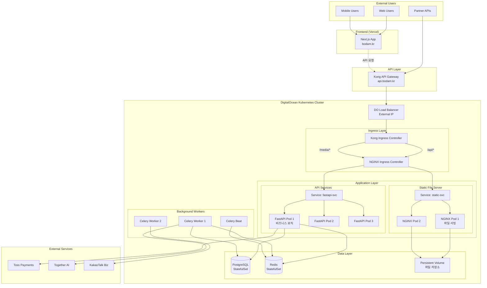
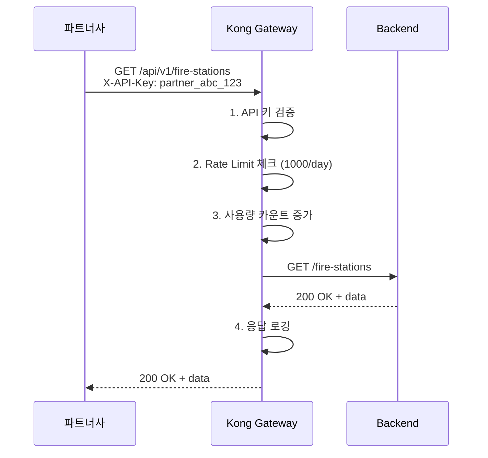

# 보담(BoDam) 배포 전략 - API Gateway 포함 버전

> **작성일**: 2025-10-01
> **대상 환경**: Production (확장성 고려)
> **주요 기술**: Vercel, DigitalOcean, Kubernetes, Kong API Gateway, NGINX

---

## 📋 목차

1. [확장성을 고려한 아키텍처](#확장성을-고려한-아키텍처)
2. [API Gateway 도입 이유](#api-gateway-도입-이유)
3. [전체 시스템 구성도](#전체-시스템-구성도)
4. [단계별 구축 가이드](#단계별-구축-가이드)
5. [실전 설정 파일](#실전-설정-파일)
6. [운영 및 모니터링](#운영-및-모니터링)

---

## 확장성을 고려한 아키텍처

### 최종 아키텍처



---

## API Gateway 도입 이유

### 1. **확장성 확보**

#### 마이크로서비스 전환 대비
```
현재:
  Kong → NGINX Ingress → FastAPI (단일 서비스)

6개월 후:
  Kong → NGINX Ingress → ┌─ User Service (FastAPI)
                          ├─ Donation Service (FastAPI)
                          ├─ Payment Service (FastAPI)
                          ├─ Notification Service (Node.js)
                          └─ Analytics Service (Python)
```

Kong이 있으면 서비스 추가 시 라우팅만 변경하면 됨.

### 2. **외부 파트너 API 제공 준비**



### 3. **고급 기능 지원**

| 기능 | Kong API Gateway | NGINX Ingress만 |
|------|-----------------|-----------------|
| **사용자별 Rate Limiting** | ✅ 가능 | ❌ IP별만 |
| **API 키 관리** | ✅ 내장 | ❌ 직접 구현 |
| **API 버전 관리** | ✅ /v1, /v2 라우팅 | ⚠️ 수동 설정 |
| **실시간 분석** | ✅ 대시보드 | ❌ 없음 |
| **플러그인 생태계** | ✅ 50+ 플러그인 | ❌ 제한적 |
| **GraphQL 지원** | ✅ 내장 | ❌ 없음 |

---

## 전체 시스템 구성도

### 네트워크 플로우

```mermaid
flowchart LR
    subgraph Internet
        User[사용자]
    end

    subgraph Vercel
        Frontend[Next.js]
    end

    subgraph DigitalOcean
        subgraph "Entry Point"
            LB[Load Balancer<br/>203.0.113.10]
        end

        subgraph "Kong Layer"
            Kong[Kong Gateway<br/>:8000/:8443]
            KongAdmin[Kong Admin API<br/>:8001]
        end

        subgraph "NGINX Layer"
            NGINX[NGINX Ingress<br/>:80/:443]
        end

        subgraph "App Layer"
            FastAPI[FastAPI Pods]
            StaticNginx[Static NGINX Pods]
        end

        subgraph "Data"
            DB[(PostgreSQL)]
            Cache[(Redis)]
            Files[Volume Storage]
        end
    end

    User -->|1. 웹사이트| Frontend
    User -->|2. API/파일| LB
    Frontend -.3. API 요청.-> LB

    LB --> Kong
    Kong -->|인증/Rate Limit| NGINX

    NGINX -->|/api/*| FastAPI
    NGINX -->|/media/*| StaticNginx

    FastAPI --> DB
    FastAPI --> Cache
    StaticNginx --> Files
```

---

## 단계별 구축 가이드

### Phase 1: Kubernetes 클러스터 생성

```bash
# doctl 설치 및 인증
snap install doctl
doctl auth init

# Kubernetes 클러스터 생성 (서울 리전 근처 - 싱가포르)
doctl kubernetes cluster create bodam-prod \
  --region sgp1 \
  --version 1.28.2-do.0 \
  --node-pool "name=app-pool;size=s-4vcpu-8gb;count=3;auto-scale=true;min-nodes=2;max-nodes=5" \
  --node-pool "name=worker-pool;size=s-2vcpu-4gb;count=2;auto-scale=true;min-nodes=1;max-nodes=4"

# kubeconfig 다운로드
doctl kubernetes cluster kubeconfig save bodam-prod

# 클러스터 확인
kubectl get nodes
```

---

### Phase 2: Kong API Gateway 설치

#### 2-1. Kong Helm Chart 설치

```bash
# Helm 설치
curl https://raw.githubusercontent.com/helm/helm/main/scripts/get-helm-3 | bash

# Kong Helm repo 추가
helm repo add kong https://charts.konghq.com
helm repo update

# Kong 설치 (Ingress Controller 포함)
helm install kong kong/kong \
  --namespace kong \
  --create-namespace \
  --set ingressController.enabled=true \
  --set ingressController.installCRDs=false \
  --set proxy.type=LoadBalancer \
  --set admin.enabled=true \
  --set admin.type=ClusterIP \
  --set admin.http.enabled=true

# Kong 설치 확인
kubectl get pods -n kong
kubectl get svc -n kong

# Kong Proxy의 External IP 확인
kubectl get svc kong-proxy -n kong
```

#### 2-2. Kong Admin API 접속

```bash
# Port Forward로 로컬 접속
kubectl port-forward -n kong svc/kong-admin 8001:8001 &

# Kong 상태 확인
curl http://localhost:8001/status

# 응답 예시:
# {
#   "database": {"reachable": true},
#   "server": {"connections_accepted": 10, "connections_active": 1}
# }
```

---

### Phase 3: NGINX Ingress 설치

```bash
# NGINX Ingress Controller 설치
helm repo add ingress-nginx https://kubernetes.github.io/ingress-nginx
helm repo update

helm install nginx-ingress ingress-nginx/ingress-nginx \
  --namespace ingress-nginx \
  --create-namespace \
  --set controller.service.type=ClusterIP \
  --set controller.ingressClassResource.name=nginx

# 설치 확인
kubectl get pods -n ingress-nginx
```

---

### Phase 4: cert-manager 설치 (SSL 인증서)

```bash
# cert-manager 설치
kubectl apply -f https://github.com/cert-manager/cert-manager/releases/download/v1.13.0/cert-manager.yaml

# Let's Encrypt Issuer 생성
cat <<EOF | kubectl apply -f -
apiVersion: cert-manager.io/v1
kind: ClusterIssuer
metadata:
  name: letsencrypt-prod
spec:
  acme:
    server: https://acme-v02.api.letsencrypt.org/directory
    email: admin@bodam.kr
    privateKeySecretRef:
      name: letsencrypt-prod
    solvers:
    - http01:
        ingress:
          class: kong
EOF
```

---

## 실전 설정 파일

### 1. Namespace 및 Secrets

```bash
# Namespace 생성
kubectl create namespace bodam

# Database Credentials
kubectl create secret generic db-credentials \
  --from-literal=username=bodam_user \
  --from-literal=password=$(openssl rand -base64 32) \
  --from-literal=database=bodam \
  -n bodam

# API Keys
kubectl create secret generic api-keys \
  --from-literal=toss_secret_key=YOUR_TOSS_SECRET \
  --from-literal=together_api_key=YOUR_TOGETHER_KEY \
  --from-literal=kakao_rest_api_key=YOUR_KAKAO_KEY \
  -n bodam

# JWT Secret
kubectl create secret generic jwt-secret \
  --from-literal=secret=$(openssl rand -base64 64) \
  -n bodam
```

---

### 2. FastAPI Deployment

```yaml
# k8s/fastapi-deployment.yaml
apiVersion: apps/v1
kind: Deployment
metadata:
  name: fastapi-backend
  namespace: bodam
  labels:
    app: fastapi
    tier: backend
spec:
  replicas: 3
  selector:
    matchLabels:
      app: fastapi
  template:
    metadata:
      labels:
        app: fastapi
    spec:
      containers:
      - name: fastapi
        image: registry.digitalocean.com/bodam-registry/backend:latest
        imagePullPolicy: Always
        ports:
        - containerPort: 8000
          name: http
        env:
        - name: DATABASE_URL
          valueFrom:
            secretKeyRef:
              name: db-credentials
              key: url
        - name: REDIS_URL
          value: "redis://redis-service:6379/0"
        - name: JWT_SECRET
          valueFrom:
            secretKeyRef:
              name: jwt-secret
              key: secret
        - name: TOSS_SECRET_KEY
          valueFrom:
            secretKeyRef:
              name: api-keys
              key: toss_secret_key
        resources:
          requests:
            memory: "512Mi"
            cpu: "500m"
          limits:
            memory: "1Gi"
            cpu: "1000m"
        livenessProbe:
          httpGet:
            path: /health
            port: 8000
          initialDelaySeconds: 30
          periodSeconds: 10
          timeoutSeconds: 5
          failureThreshold: 3
        readinessProbe:
          httpGet:
            path: /health
            port: 8000
          initialDelaySeconds: 10
          periodSeconds: 5
          timeoutSeconds: 3
---
apiVersion: v1
kind: Service
metadata:
  name: fastapi-service
  namespace: bodam
spec:
  selector:
    app: fastapi
  ports:
  - protocol: TCP
    port: 8000
    targetPort: 8000
  type: ClusterIP
```

---

### 3. Static NGINX Deployment

```yaml
# k8s/static-nginx-deployment.yaml
apiVersion: v1
kind: ConfigMap
metadata:
  name: nginx-static-config
  namespace: bodam
data:
  nginx.conf: |
    user nginx;
    worker_processes auto;
    error_log /var/log/nginx/error.log warn;
    pid /var/run/nginx.pid;

    events {
      worker_connections 1024;
    }

    http {
      include /etc/nginx/mime.types;
      default_type application/octet-stream;

      log_format main '$remote_addr - $remote_user [$time_local] "$request" '
                      '$status $body_bytes_sent "$http_referer" '
                      '"$http_user_agent" "$http_x_forwarded_for"';

      access_log /var/log/nginx/access.log main;
      sendfile on;
      tcp_nopush on;
      keepalive_timeout 65;
      gzip on;

      server {
        listen 80;
        server_name _;

        # 업로드된 파일 서빙
        location /media/ {
          alias /data/media/;
          expires 1y;
          add_header Cache-Control "public, immutable";
          add_header Access-Control-Allow-Origin "*";
          autoindex off;
        }

        # 영수증 PDF 서빙
        location /receipts/ {
          alias /data/receipts/;
          expires 30d;
          add_header Cache-Control "public";
          add_header Content-Disposition "attachment";
        }

        # Health check
        location /health {
          access_log off;
          return 200 "healthy\n";
          add_header Content-Type text/plain;
        }
      }
    }
---
apiVersion: apps/v1
kind: Deployment
metadata:
  name: static-nginx
  namespace: bodam
spec:
  replicas: 2
  selector:
    matchLabels:
      app: static-nginx
  template:
    metadata:
      labels:
        app: static-nginx
    spec:
      containers:
      - name: nginx
        image: nginx:1.25-alpine
        ports:
        - containerPort: 80
        volumeMounts:
        - name: nginx-config
          mountPath: /etc/nginx/nginx.conf
          subPath: nginx.conf
        - name: media-storage
          mountPath: /data
        resources:
          requests:
            memory: "128Mi"
            cpu: "100m"
          limits:
            memory: "256Mi"
            cpu: "200m"
      volumes:
      - name: nginx-config
        configMap:
          name: nginx-static-config
      - name: media-storage
        persistentVolumeClaim:
          claimName: media-pvc
---
apiVersion: v1
kind: Service
metadata:
  name: static-nginx-service
  namespace: bodam
spec:
  selector:
    app: static-nginx
  ports:
  - protocol: TCP
    port: 80
    targetPort: 80
  type: ClusterIP
---
apiVersion: v1
kind: PersistentVolumeClaim
metadata:
  name: media-pvc
  namespace: bodam
spec:
  accessModes:
    - ReadWriteMany
  resources:
    requests:
      storage: 50Gi
  storageClassName: do-block-storage
```

---

### 4. Kong Ingress 설정 (Main Entry Point)

```yaml
# k8s/kong-ingress.yaml
apiVersion: networking.k8s.io/v1
kind: Ingress
metadata:
  name: kong-main-ingress
  namespace: bodam
  annotations:
    cert-manager.io/cluster-issuer: "letsencrypt-prod"
    konghq.com/strip-path: "false"
    konghq.com/plugins: rate-limiting-global, cors-global, logging-global
spec:
  ingressClassName: kong
  tls:
  - hosts:
    - api.bodam.kr
    secretName: api-bodam-kr-tls
  rules:
  - host: api.bodam.kr
    http:
      paths:
      # 모든 요청을 NGINX Ingress로 전달
      - path: /
        pathType: Prefix
        backend:
          service:
            name: nginx-ingress-controller
            port:
              number: 80
            namespace: ingress-nginx
```

---

### 5. Kong Plugins 설정

```yaml
# k8s/kong-plugins.yaml

# 1. Rate Limiting (전역)
apiVersion: configuration.konghq.com/v1
kind: KongPlugin
metadata:
  name: rate-limiting-global
  namespace: bodam
config:
  minute: 100
  hour: 5000
  policy: local
  limit_by: consumer
  fault_tolerant: true
plugin: rate-limiting
---
# 2. CORS (전역)
apiVersion: configuration.konghq.com/v1
kind: KongPlugin
metadata:
  name: cors-global
  namespace: bodam
config:
  origins:
    - https://bodam.kr
    - https://bodam.vercel.app
    - http://localhost:3000
  methods:
    - GET
    - POST
    - PUT
    - DELETE
    - PATCH
    - OPTIONS
  headers:
    - Accept
    - Accept-Language
    - Authorization
    - Content-Type
    - X-Requested-With
  exposed_headers:
    - X-Auth-Token
  credentials: true
  max_age: 3600
plugin: cors
---
# 3. HTTP Logging
apiVersion: configuration.konghq.com/v1
kind: KongPlugin
metadata:
  name: logging-global
  namespace: bodam
config:
  http_endpoint: http://logstash.monitoring.svc.cluster.local:5000
  method: POST
  timeout: 1000
  keepalive: 60000
plugin: http-log
---
# 4. JWT Authentication (선택적)
apiVersion: configuration.konghq.com/v1
kind: KongPlugin
metadata:
  name: jwt-auth
  namespace: bodam
config:
  key_claim_name: iss
  secret_is_base64: false
  uri_param_names:
    - jwt
  cookie_names:
    - bodam_session
plugin: jwt
---
# 5. API Key Authentication (파트너용)
apiVersion: configuration.konghq.com/v1
kind: KongPlugin
metadata:
  name: key-auth-partner
  namespace: bodam
config:
  key_names:
    - apikey
    - x-api-key
  hide_credentials: true
plugin: key-auth
```

---

### 6. NGINX Ingress 설정 (Internal Routing)

```yaml
# k8s/nginx-ingress.yaml
apiVersion: networking.k8s.io/v1
kind: Ingress
metadata:
  name: nginx-internal-routing
  namespace: bodam
  annotations:
    nginx.ingress.kubernetes.io/rewrite-target: /$2
    nginx.ingress.kubernetes.io/use-regex: "true"
spec:
  ingressClassName: nginx
  rules:
  - http:
      paths:
      # API 요청 → FastAPI
      - path: /api(/|$)(.*)
        pathType: Prefix
        backend:
          service:
            name: fastapi-service
            port:
              number: 8000

      # 파일 다운로드 → Static NGINX
      - path: /media(/|$)(.*)
        pathType: Prefix
        backend:
          service:
            name: static-nginx-service
            port:
              number: 80

      # 영수증 다운로드 → Static NGINX
      - path: /receipts(/|$)(.*)
        pathType: Prefix
        backend:
          service:
            name: static-nginx-service
            port:
              number: 80

      # Health check
      - path: /health
        pathType: Exact
        backend:
          service:
            name: fastapi-service
            port:
              number: 8000
```

---

### 7. PostgreSQL StatefulSet

```yaml
# k8s/postgresql.yaml
apiVersion: v1
kind: Service
metadata:
  name: postgresql
  namespace: bodam
spec:
  selector:
    app: postgresql
  ports:
  - port: 5432
  clusterIP: None
---
apiVersion: apps/v1
kind: StatefulSet
metadata:
  name: postgresql
  namespace: bodam
spec:
  serviceName: postgresql
  replicas: 1
  selector:
    matchLabels:
      app: postgresql
  template:
    metadata:
      labels:
        app: postgresql
    spec:
      containers:
      - name: postgresql
        image: postgres:15-alpine
        ports:
        - containerPort: 5432
          name: postgres
        env:
        - name: POSTGRES_DB
          valueFrom:
            secretKeyRef:
              name: db-credentials
              key: database
        - name: POSTGRES_USER
          valueFrom:
            secretKeyRef:
              name: db-credentials
              key: username
        - name: POSTGRES_PASSWORD
          valueFrom:
            secretKeyRef:
              name: db-credentials
              key: password
        - name: PGDATA
          value: /var/lib/postgresql/data/pgdata
        volumeMounts:
        - name: postgresql-storage
          mountPath: /var/lib/postgresql/data
        resources:
          requests:
            memory: "1Gi"
            cpu: "500m"
          limits:
            memory: "2Gi"
            cpu: "1000m"
  volumeClaimTemplates:
  - metadata:
      name: postgresql-storage
    spec:
      accessModes: ["ReadWriteOnce"]
      storageClassName: do-block-storage
      resources:
        requests:
          storage: 20Gi
```

---

### 8. Redis StatefulSet

```yaml
# k8s/redis.yaml
apiVersion: v1
kind: Service
metadata:
  name: redis-service
  namespace: bodam
spec:
  selector:
    app: redis
  ports:
  - port: 6379
  clusterIP: None
---
apiVersion: apps/v1
kind: StatefulSet
metadata:
  name: redis
  namespace: bodam
spec:
  serviceName: redis-service
  replicas: 1
  selector:
    matchLabels:
      app: redis
  template:
    metadata:
      labels:
        app: redis
    spec:
      containers:
      - name: redis
        image: redis:7-alpine
        ports:
        - containerPort: 6379
          name: redis
        command:
        - redis-server
        - --appendonly yes
        - --requirepass $(REDIS_PASSWORD)
        env:
        - name: REDIS_PASSWORD
          valueFrom:
            secretKeyRef:
              name: redis-credentials
              key: password
        volumeMounts:
        - name: redis-storage
          mountPath: /data
        resources:
          requests:
            memory: "256Mi"
            cpu: "250m"
          limits:
            memory: "512Mi"
            cpu: "500m"
  volumeClaimTemplates:
  - metadata:
      name: redis-storage
    spec:
      accessModes: ["ReadWriteOnce"]
      storageClassName: do-block-storage
      resources:
        requests:
          storage: 10Gi
```

---

### 9. Celery Workers

```yaml
# k8s/celery-workers.yaml
apiVersion: apps/v1
kind: Deployment
metadata:
  name: celery-worker
  namespace: bodam
spec:
  replicas: 2
  selector:
    matchLabels:
      app: celery-worker
  template:
    metadata:
      labels:
        app: celery-worker
    spec:
      containers:
      - name: celery
        image: registry.digitalocean.com/bodam-registry/backend:latest
        command:
        - celery
        - -A
        - src.worker
        - worker
        - --loglevel=info
        - --concurrency=4
        env:
        - name: DATABASE_URL
          valueFrom:
            secretKeyRef:
              name: db-credentials
              key: url
        - name: REDIS_URL
          value: "redis://redis-service:6379/0"
        - name: CELERY_BROKER_URL
          value: "redis://redis-service:6379/1"
        resources:
          requests:
            memory: "512Mi"
            cpu: "500m"
          limits:
            memory: "1Gi"
            cpu: "1000m"
---
apiVersion: apps/v1
kind: Deployment
metadata:
  name: celery-beat
  namespace: bodam
spec:
  replicas: 1
  selector:
    matchLabels:
      app: celery-beat
  template:
    metadata:
      labels:
        app: celery-beat
    spec:
      containers:
      - name: celery-beat
        image: registry.digitalocean.com/bodam-registry/backend:latest
        command:
        - celery
        - -A
        - src.worker
        - beat
        - --loglevel=info
        env:
        - name: REDIS_URL
          value: "redis://redis-service:6379/1"
        resources:
          requests:
            memory: "128Mi"
            cpu: "100m"
```

---

## 운영 및 모니터링

### 1. Kong Consumer 생성 (파트너 API 키)

```bash
# 파트너사 등록
curl -X POST http://localhost:8001/consumers \
  --data "username=partner-company-a" \
  --data "custom_id=PARTNER_A"

# API 키 발급
curl -X POST http://localhost:8001/consumers/partner-company-a/key-auth \
  --data "key=pk_live_partner_a_abc123def456"

# Rate Limiting 설정 (파트너별)
curl -X POST http://localhost:8001/consumers/partner-company-a/plugins \
  --data "name=rate-limiting" \
  --data "config.minute=1000" \
  --data "config.hour=50000" \
  --data "config.policy=local"
```

### 2. 파트너사 API 사용 예시

```bash
# 파트너사가 API 호출
curl -X GET https://api.bodam.kr/api/fire-stations \
  -H "x-api-key: pk_live_partner_a_abc123def456"

# Kong이 자동으로:
# 1. API 키 검증
# 2. Rate Limit 체크
# 3. 로깅
# 4. FastAPI로 프록시
```

### 3. Prometheus + Grafana 모니터링

```bash
# Prometheus Stack 설치
helm repo add prometheus-community https://prometheus-community.github.io/helm-charts
helm install prometheus prometheus-community/kube-prometheus-stack \
  --namespace monitoring \
  --create-namespace

# Grafana 접속
kubectl port-forward -n monitoring svc/prometheus-grafana 3000:80

# http://localhost:3000
# ID: admin
# PW: prom-operator
```

### 4. Kong Admin API를 통한 모니터링

```bash
# API 통계 조회
curl http://localhost:8001/status | jq

# 현재 설정된 서비스
curl http://localhost:8001/services | jq

# 플러그인 목록
curl http://localhost:8001/plugins | jq

# Consumer 목록
curl http://localhost:8001/consumers | jq
```

---

## 배포 자동화 (CI/CD)

### GitHub Actions - Backend 배포

```yaml
# .github/workflows/deploy-backend.yml
name: Deploy Backend to Kubernetes

on:
  push:
    branches: [main]
    paths:
      - 'backend/**'

env:
  REGISTRY: registry.digitalocean.com/bodam-registry
  IMAGE_NAME: backend

jobs:
  build-and-deploy:
    runs-on: ubuntu-latest
    steps:
      - name: Checkout code
        uses: actions/checkout@v3

      - name: Install doctl
        uses: digitalocean/action-doctl@v2
        with:
          token: ${{ secrets.DIGITALOCEAN_ACCESS_TOKEN }}

      - name: Build Docker image
        run: |
          cd backend
          docker build -t ${{ env.REGISTRY }}/${{ env.IMAGE_NAME }}:${{ github.sha }} .
          docker tag ${{ env.REGISTRY }}/${{ env.IMAGE_NAME }}:${{ github.sha }} ${{ env.REGISTRY }}/${{ env.IMAGE_NAME }}:latest

      - name: Log in to DO Container Registry
        run: doctl registry login --expiry-seconds 600

      - name: Push image to DO Registry
        run: |
          docker push ${{ env.REGISTRY }}/${{ env.IMAGE_NAME }}:${{ github.sha }}
          docker push ${{ env.REGISTRY }}/${{ env.IMAGE_NAME }}:latest

      - name: Save kubeconfig
        run: doctl kubernetes cluster kubeconfig save bodam-prod

      - name: Deploy to Kubernetes
        run: |
          kubectl set image deployment/fastapi-backend \
            fastapi=${{ env.REGISTRY }}/${{ env.IMAGE_NAME }}:${{ github.sha }} \
            -n bodam

          kubectl rollout status deployment/fastapi-backend -n bodam

          kubectl set image deployment/celery-worker \
            celery=${{ env.REGISTRY }}/${{ env.IMAGE_NAME }}:${{ github.sha }} \
            -n bodam

          kubectl rollout status deployment/celery-worker -n bodam

      - name: Verify deployment
        run: |
          kubectl get pods -n bodam
          kubectl get svc -n bodam
```

---

## 비용 분석

### 월간 예상 비용

| 항목 | 스펙 | 수량 | 단가 | 합계 |
|------|------|------|------|------|
| **Vercel Pro** | Frontend hosting | 1 | $20 | $20 |
| **DO Kubernetes** | s-4vcpu-8gb | 3 nodes | $48 | $144 |
| **DO Kubernetes** | s-2vcpu-4gb (worker) | 2 nodes | $24 | $48 |
| **DO Load Balancer** | - | 1 | $12 | $12 |
| **DO Block Storage** | PostgreSQL | 20GB | $2 | $2 |
| **DO Block Storage** | Redis | 10GB | $1 | $1 |
| **DO Block Storage** | Media files | 50GB | $5 | $5 |
| **DO Container Registry** | - | 5GB | $5 | $5 |
| **도메인** | .kr | 1/year | $3/mo | $3 |
| **Total** | | | | **$240/월** |

### 비용 최적화 옵션

#### 옵션 1: Managed Database 사용 (권장)
```
Self-hosted PostgreSQL 제거 → DO Managed PostgreSQL ($15/mo)
- 자동 백업
- 자동 업데이트
- 고가용성

총 비용: $240 → $255/월 (관리 편의성 ↑)
```

#### 옵션 2: 개발/스테이징 환경
```
Node 축소: s-2vcpu-4gb x 2
총 비용: $240 → $80/월
```

---

## 트러블슈팅

### 1. Kong 연결 안 됨
```bash
# Kong Proxy 확인
kubectl logs -n kong deployment/kong-kong -f

# Kong Admin API 확인
kubectl port-forward -n kong svc/kong-admin 8001:8001
curl http://localhost:8001/status

# Ingress 확인
kubectl describe ingress kong-main-ingress -n bodam
```

### 2. NGINX Ingress 라우팅 실패
```bash
# NGINX Logs 확인
kubectl logs -n ingress-nginx deployment/nginx-ingress-controller -f

# Ingress 상태
kubectl describe ingress nginx-internal-routing -n bodam

# Service 확인
kubectl get svc -n bodam
```

### 3. FastAPI Pod 재시작 반복
```bash
# Pod 상태 확인
kubectl describe pod <pod-name> -n bodam

# 로그 확인
kubectl logs <pod-name> -n bodam --previous

# Health check 테스트
kubectl exec -it <pod-name> -n bodam -- curl localhost:8000/health
```

---

## 다음 단계

### Phase 5: 고급 기능

1. **HPA (Horizontal Pod Autoscaler)**
```bash
kubectl autoscale deployment fastapi-backend \
  --cpu-percent=70 \
  --min=3 \
  --max=10 \
  -n bodam
```

2. **Kong Rate Limiting 고도화**
- 사용자별 Tier 시스템 (Free: 100/day, Pro: 10000/day)
- API별 다른 제한

3. **Blue-Green Deployment**
```yaml
# v2 배포
kubectl apply -f fastapi-v2-deployment.yaml

# 트래픽 전환 (Kong Ingress 수정)
# v1: 90% → v2: 10% (Canary)
# v1: 50% → v2: 50%
# v1: 0% → v2: 100%
```

---

## 결론

이 아키텍처는 **확장성을 고려한 프로덕션 환경**입니다:

✅ **Kong API Gateway**: 외부 파트너 API, Rate Limiting, 인증
✅ **NGINX Ingress**: 내부 라우팅, 정적 파일 서빙 분리
✅ **FastAPI Pod**: 순수 비즈니스 로직만 처리
✅ **Static NGINX Pod**: 파일 서빙 전담
✅ **Auto-scaling**: 트래픽 증가 시 자동 확장

**문서 버전**: 1.0.0
**최종 업데이트**: 2025-10-01
**작성자**: Claude Sonnet 4.5
